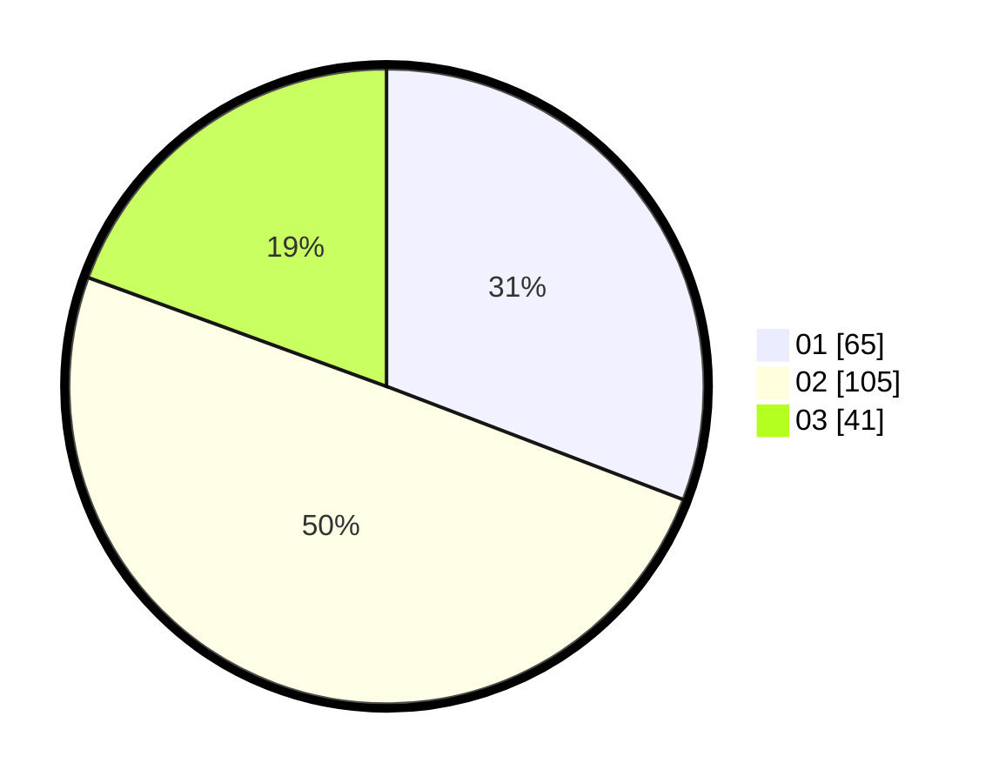

# Hasil

Hasil perolehan suara paslon dapat dilihat pada file paslon-01.txt, paslon-02.txt, dan paslon-03.txt.

Jika tidak ada, artinya data tersebut belum ada pada SIREKAP.

## Perolehan Suara

 * Paslon 01: **65**.
 * Paslon 02: **105**.
 * Paslon 03: **41**.

## Foto C Plano

https://sirekap-obj-formc.kpu.go.id/7e5c/pemilu/ppwp/31/75/02/10/05/3175021005052-20240214-231924--4d11f043-077b-4f53-9be7-48d17dc6e8ea.jpg

https://sirekap-obj-formc.kpu.go.id/7e5c/pemilu/ppwp/31/75/02/10/05/3175021005052-20240214-232131--e8e45094-0b1b-404e-849d-9bb0e1c1bd1a.jpg

https://sirekap-obj-formc.kpu.go.id/7e5c/pemilu/ppwp/31/75/02/10/05/3175021005052-20240214-232155--6f4beefa-8f71-4200-854d-d680dabcc538.jpg
