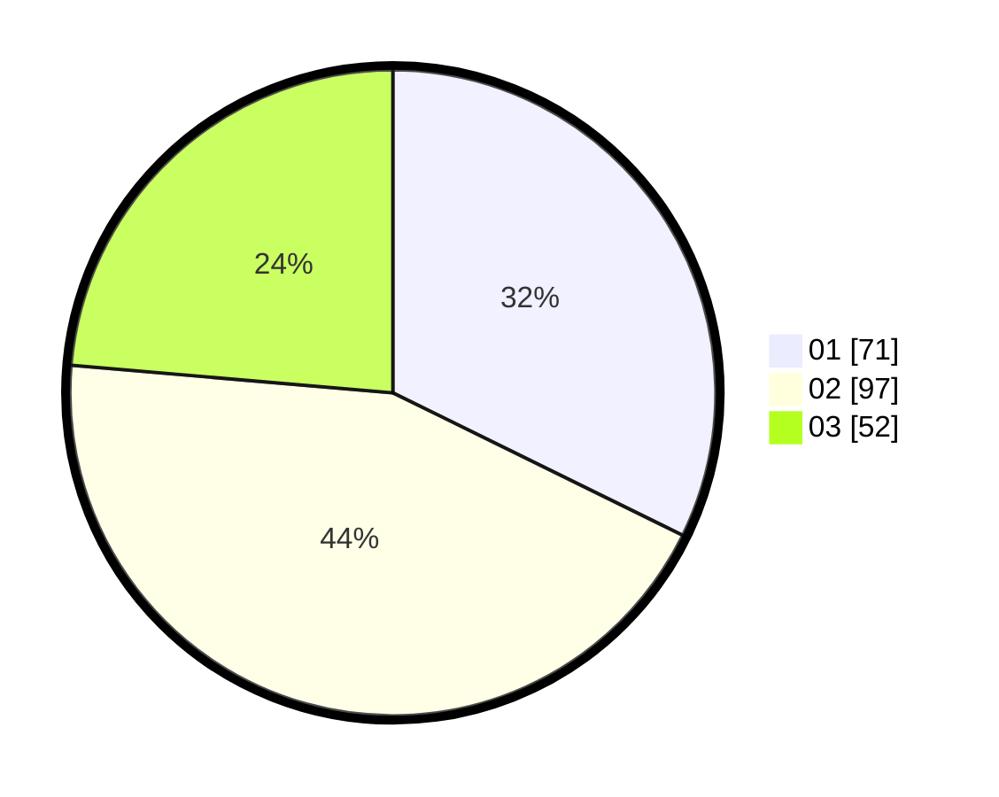

# Hasil

Hasil perolehan suara paslon dapat dilihat pada file paslon-01.txt, paslon-02.txt, dan paslon-03.txt.

Jika tidak ada, artinya data tersebut belum ada pada SIREKAP.

## Perolehan Suara

 * Paslon 01: **71**.
 * Paslon 02: **97**.
 * Paslon 03: **52**.

## Foto C Plano

https://sirekap-obj-formc.kpu.go.id/a91b/pemilu/ppwp/31/75/02/10/05/3175021005054-20240214-205045--ce65e2b5-6716-4bfd-ba62-a6dcff5b8d11.jpg

https://sirekap-obj-formc.kpu.go.id/a91b/pemilu/ppwp/31/75/02/10/05/3175021005054-20240214-205334--38637361-f020-4d81-b554-3ad25aa9a314.jpg

https://sirekap-obj-formc.kpu.go.id/a91b/pemilu/ppwp/31/75/02/10/05/3175021005054-20240214-200743--94fa3ee6-5966-4515-89c2-4400fb2754e9.jpg
