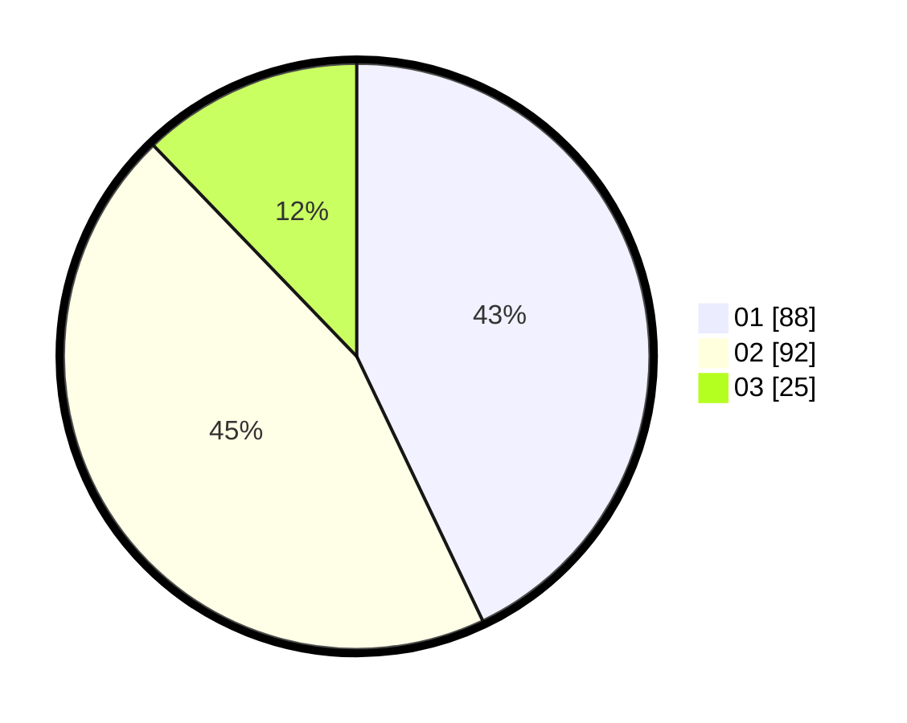

# Hasil

Hasil perolehan suara paslon dapat dilihat pada file paslon-01.txt, paslon-02.txt, dan paslon-03.txt.

Jika tidak ada, artinya data tersebut belum ada pada SIREKAP.

## Perolehan Suara

 * Paslon 01: **88**.
 * Paslon 02: **92**.
 * Paslon 03: **25**.

## Foto C Plano

https://sirekap-obj-formc.kpu.go.id/0990/pemilu/ppwp/31/75/02/10/05/3175021005055-20240214-231339--07b67837-7956-4292-b416-b7a9624170bc.jpg

https://sirekap-obj-formc.kpu.go.id/0990/pemilu/ppwp/31/75/02/10/05/3175021005055-20240214-231350--a40d1844-cb12-419f-a8ef-dfd3f2ee1a00.jpg

https://sirekap-obj-formc.kpu.go.id/0990/pemilu/ppwp/31/75/02/10/05/3175021005055-20240214-231354--18f53531-a4a4-4ee7-b2d3-1973f4668454.jpg

## DATA PEMILIH TETAP

Jumlah pemilih dalam DPT: **275**.
 * L: **127**.
 * P: **148**.

## DATA PENGGUNA HAK PILIH

Jumlah pengguna hak pilih dalam DPT: **203**.
 * L: **90**.
 * P: **113**.

Jumlah pengguna hak pilih dalam DPTb: **2**.
 * L: **2**.
 * P: **0**.

Jumlah pengguna hak pilih dalam DPK: **4**.
 * L: **2**.
 * P: **2**.

Jumlah pengguna hak pilih: **209**.
 * L: **94**.
 * P: **115**.

## JUMLAH SUARA SAH DAN TIDAK SAH

JUMLAH SELURUH SUARA SAH: **205**.

JUMLAH SUARA TIDAK SAH: **4**.

JUMLAH SELURUH SUARA SAH DAN SUARA TIDAK SAH: **209**.
