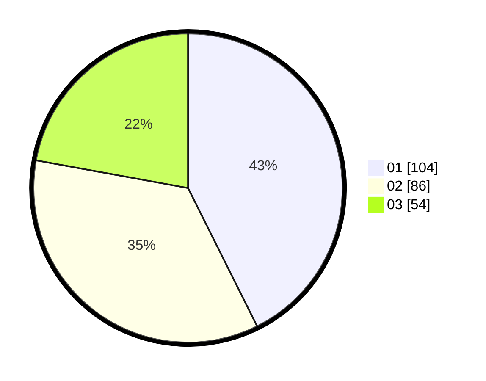

# Hasil

Hasil perolehan suara paslon dapat dilihat pada file paslon-01.txt, paslon-02.txt, dan paslon-03.txt.

Jika tidak ada, artinya data tersebut belum ada pada SIREKAP.

## Perolehan Suara

 * Paslon 01: **104**.
 * Paslon 02: **86**.
 * Paslon 03: **54**.

## Foto C Plano

https://sirekap-obj-formc.kpu.go.id/1f85/pemilu/ppwp/31/75/02/10/05/3175021005065-20240215-011931--d8ad56b6-b7ff-433d-ac44-e4f5e8ffb085.jpg

https://sirekap-obj-formc.kpu.go.id/1f85/pemilu/ppwp/31/75/02/10/05/3175021005065-20240215-010903--1adac7bc-3344-4250-b8fe-f7f0e7da42c9.jpg

https://sirekap-obj-formc.kpu.go.id/1f85/pemilu/ppwp/31/75/02/10/05/3175021005065-20240215-011657--4dc9af1f-b6d9-451e-9156-05ef932ffd9d.jpg

## DATA PEMILIH TETAP

Jumlah pemilih dalam DPT: **295**.
 * L: **143**.
 * P: **152**.

## DATA PENGGUNA HAK PILIH

Jumlah pengguna hak pilih dalam DPT: **238**.
 * L: **115**.
 * P: **123**.

Jumlah pengguna hak pilih dalam DPTb: **7**.
 * L: **1**.
 * P: **6**.

Jumlah pengguna hak pilih dalam DPK: **6**.
 * L: **2**.
 * P: **4**.

Jumlah pengguna hak pilih: **251**.
 * L: **118**.
 * P: **133**.

## JUMLAH SUARA SAH DAN TIDAK SAH

JUMLAH SELURUH SUARA SAH: **244**.

JUMLAH SUARA TIDAK SAH: **7**.

JUMLAH SELURUH SUARA SAH DAN SUARA TIDAK SAH: **251**.
