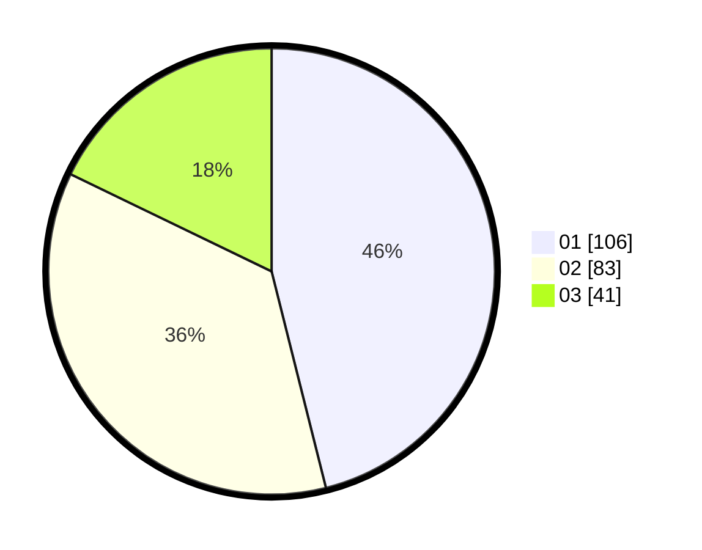

# Hasil

Hasil perolehan suara paslon dapat dilihat pada file paslon-01.txt, paslon-02.txt, dan paslon-03.txt.

Jika tidak ada, artinya data tersebut belum ada pada SIREKAP.

## Perolehan Suara

 * Paslon 01: **106**.
 * Paslon 02: **83**.
 * Paslon 03: **41**.

## Foto C Plano

https://sirekap-obj-formc.kpu.go.id/0592/pemilu/ppwp/31/75/02/10/05/3175021005066-20240216-002348--c805d8eb-35c6-436a-a694-06c8ae30afc7.jpg

https://sirekap-obj-formc.kpu.go.id/0592/pemilu/ppwp/31/75/02/10/05/3175021005066-20240216-002350--d0839e2a-e6e4-4f24-9e89-d103d7c2c751.jpg

https://sirekap-obj-formc.kpu.go.id/0592/pemilu/ppwp/31/75/02/10/05/3175021005066-20240216-002349--39fb5163-c5f0-4532-93e9-e8f636d1e1be.jpg

## DATA PEMILIH TETAP

Jumlah pemilih dalam DPT: **293**.
 * L: **137**.
 * P: **156**.

## DATA PENGGUNA HAK PILIH

Jumlah pengguna hak pilih dalam DPT: **224**.
 * L: **101**.
 * P: **123**.

Jumlah pengguna hak pilih dalam DPTb: **8**.
 * L: **3**.
 * P: **5**.

Jumlah pengguna hak pilih dalam DPK: **1**.
 * L: **0**.
 * P: **1**.

Jumlah pengguna hak pilih: **233**.
 * L: **104**.
 * P: **129**.

## JUMLAH SUARA SAH DAN TIDAK SAH

JUMLAH SELURUH SUARA SAH: **230**.

JUMLAH SUARA TIDAK SAH: **3**.

JUMLAH SELURUH SUARA SAH DAN SUARA TIDAK SAH: **233**.
