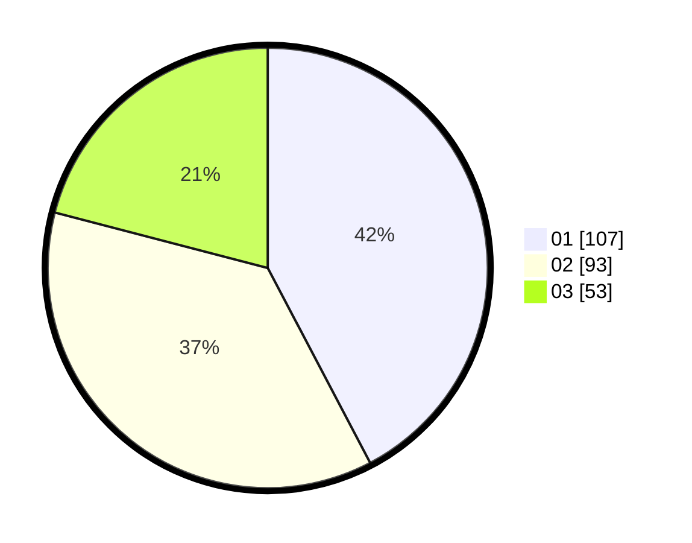

# Hasil

Hasil perolehan suara paslon dapat dilihat pada file paslon-01.txt, paslon-02.txt, dan paslon-03.txt.

Jika tidak ada, artinya data tersebut belum ada pada SIREKAP.

## Perolehan Suara

 * Paslon 01: **107**.
 * Paslon 02: **93**.
 * Paslon 03: **53**.

## Foto C Plano

https://sirekap-obj-formc.kpu.go.id/9d4e/pemilu/ppwp/31/75/02/10/05/3175021005077-20240216-115525--2021f4a2-82ce-4e60-a55e-ca0a4ec3cefe.jpg

https://sirekap-obj-formc.kpu.go.id/9d4e/pemilu/ppwp/31/75/02/10/05/3175021005077-20240216-115534--3ad53bd5-3dfc-4310-bf64-e4ffc9356d05.jpg

https://sirekap-obj-formc.kpu.go.id/9d4e/pemilu/ppwp/31/75/02/10/05/3175021005077-20240216-115531--4f653b80-1396-4f6d-9323-cfbfc39caac1.jpg

## DATA PEMILIH TETAP

Jumlah pemilih dalam DPT: **294**.
 * L: **143**.
 * P: **152**.

## DATA PENGGUNA HAK PILIH

Jumlah pengguna hak pilih dalam DPT: **244**.
 * L: **114**.
 * P: **130**.

Jumlah pengguna hak pilih dalam DPTb: **12**.
 * L: **4**.
 * P: **8**.

Jumlah pengguna hak pilih dalam DPK: **1**.
 * L: **1**.
 * P: **0**.

Jumlah pengguna hak pilih: **257**.
 * L: **119**.
 * P: **138**.

## JUMLAH SUARA SAH DAN TIDAK SAH

JUMLAH SELURUH SUARA SAH: **253**.

JUMLAH SUARA TIDAK SAH: **4**.

JUMLAH SELURUH SUARA SAH DAN SUARA TIDAK SAH: **257**.
