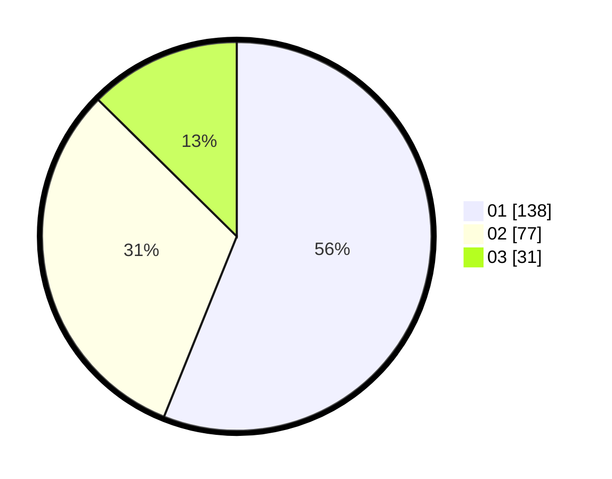

# Hasil

Hasil perolehan suara paslon dapat dilihat pada file paslon-01.txt, paslon-02.txt, dan paslon-03.txt.

Jika tidak ada, artinya data tersebut belum ada pada SIREKAP.

## Perolehan Suara

 * Paslon 01: **138**.
 * Paslon 02: **77**.
 * Paslon 03: **31**.

## Foto C Plano

https://sirekap-obj-formc.kpu.go.id/a954/pemilu/ppwp/31/75/02/10/05/3175021005081-20240215-073516--c571fe86-5301-44fc-aad0-61201196057b.jpg

https://sirekap-obj-formc.kpu.go.id/a954/pemilu/ppwp/31/75/02/10/05/3175021005081-20240215-073538--02cc7c78-3820-4d4c-ba86-ac244532de08.jpg

https://sirekap-obj-formc.kpu.go.id/a954/pemilu/ppwp/31/75/02/10/05/3175021005081-20240215-073527--35cdcf6e-bb07-45fb-b76c-b3002c822422.jpg

## DATA PEMILIH TETAP

Jumlah pemilih dalam DPT: **283**.
 * L: **130**.
 * P: **153**.

## DATA PENGGUNA HAK PILIH

Jumlah pengguna hak pilih dalam DPT: **232**.
 * L: **103**.
 * P: **129**.

Jumlah pengguna hak pilih dalam DPTb: **7**.
 * L: **0**.
 * P: **7**.

Jumlah pengguna hak pilih dalam DPK: **11**.
 * L: **4**.
 * P: **7**.

Jumlah pengguna hak pilih: **250**.
 * L: **107**.
 * P: **143**.

## JUMLAH SUARA SAH DAN TIDAK SAH

JUMLAH SELURUH SUARA SAH: **246**.

JUMLAH SUARA TIDAK SAH: **4**.

JUMLAH SELURUH SUARA SAH DAN SUARA TIDAK SAH: **250**.
