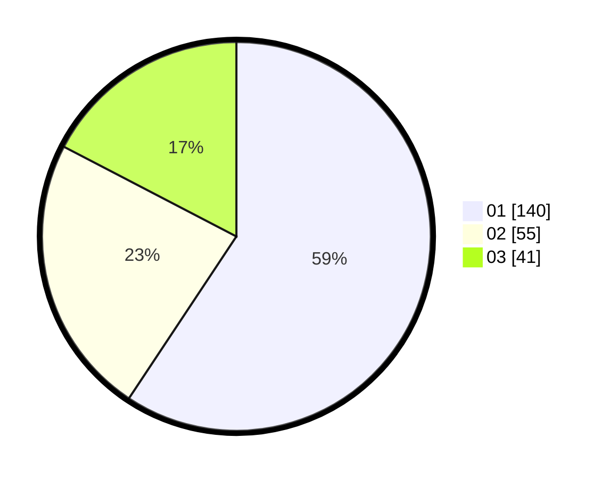

# Hasil

Hasil perolehan suara paslon dapat dilihat pada file paslon-01.txt, paslon-02.txt, dan paslon-03.txt.

Jika tidak ada, artinya data tersebut belum ada pada SIREKAP.

## Perolehan Suara

 * Paslon 01: **140**.
 * Paslon 02: **55**.
 * Paslon 03: **41**.

## Foto C Plano

https://sirekap-obj-formc.kpu.go.id/0255/pemilu/ppwp/31/75/02/10/05/3175021005086-20240216-143153--91c3a3c2-ee20-4c75-8229-7c611d1c0c04.jpg

https://sirekap-obj-formc.kpu.go.id/0255/pemilu/ppwp/31/75/02/10/05/3175021005086-20240216-143154--cbe43fee-b163-4fe7-903e-3bbf81c7261c.jpg

https://sirekap-obj-formc.kpu.go.id/0255/pemilu/ppwp/31/75/02/10/05/3175021005086-20240216-143154--6085e6ba-5e24-42ac-b7ec-5f36317d8b1b.jpg

## DATA PEMILIH TETAP

Jumlah pemilih dalam DPT: **283**.
 * L: **131**.
 * P: **152**.

## DATA PENGGUNA HAK PILIH

Jumlah pengguna hak pilih dalam DPT: **225**.
 * L: **106**.
 * P: **119**.

Jumlah pengguna hak pilih dalam DPTb: **12**.
 * L: **5**.
 * P: **7**.

Jumlah pengguna hak pilih dalam DPK: **2**.
 * L: **0**.
 * P: **2**.

Jumlah pengguna hak pilih: **239**.
 * L: **111**.
 * P: **128**.

## JUMLAH SUARA SAH DAN TIDAK SAH

JUMLAH SELURUH SUARA SAH: **236**.

JUMLAH SUARA TIDAK SAH: **3**.

JUMLAH SELURUH SUARA SAH DAN SUARA TIDAK SAH: **239**.
