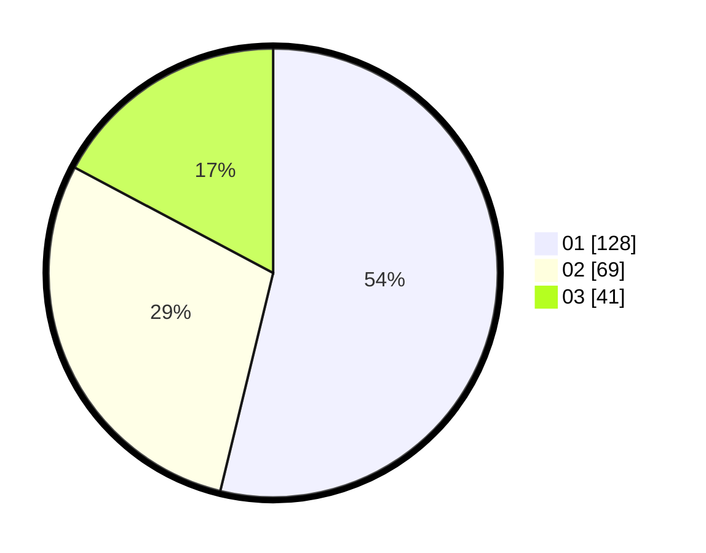

# Hasil

Hasil perolehan suara paslon dapat dilihat pada file paslon-01.txt, paslon-02.txt, dan paslon-03.txt.

Jika tidak ada, artinya data tersebut belum ada pada SIREKAP.

## Perolehan Suara

 * Paslon 01: **128**.
 * Paslon 02: **69**.
 * Paslon 03: **41**.

## Foto C Plano

https://sirekap-obj-formc.kpu.go.id/072f/pemilu/ppwp/31/75/02/10/05/3175021005087-20240215-204416--690b07a8-0242-4205-af6b-7bde271b09ba.jpg

https://sirekap-obj-formc.kpu.go.id/072f/pemilu/ppwp/31/75/02/10/05/3175021005087-20240215-204417--b9b88103-7004-4f7e-b7ae-d93dd13742d0.jpg

https://sirekap-obj-formc.kpu.go.id/072f/pemilu/ppwp/31/75/02/10/05/3175021005087-20240215-204416--8136aaad-4a58-46ef-8ef2-a410fd40ec94.jpg

## DATA PEMILIH TETAP

Jumlah pemilih dalam DPT: **281**.
 * L: **132**.
 * P: **149**.

## DATA PENGGUNA HAK PILIH

Jumlah pengguna hak pilih dalam DPT: **231**.
 * L: **108**.
 * P: **123**.

Jumlah pengguna hak pilih dalam DPTb: **6**.
 * L: **1**.
 * P: **5**.

Jumlah pengguna hak pilih dalam DPK: **3**.
 * L: **2**.
 * P: **1**.

Jumlah pengguna hak pilih: **240**.
 * L: **111**.
 * P: **129**.

## JUMLAH SUARA SAH DAN TIDAK SAH

JUMLAH SELURUH SUARA SAH: **238**.

JUMLAH SUARA TIDAK SAH: **2**.

JUMLAH SELURUH SUARA SAH DAN SUARA TIDAK SAH: **240**.
