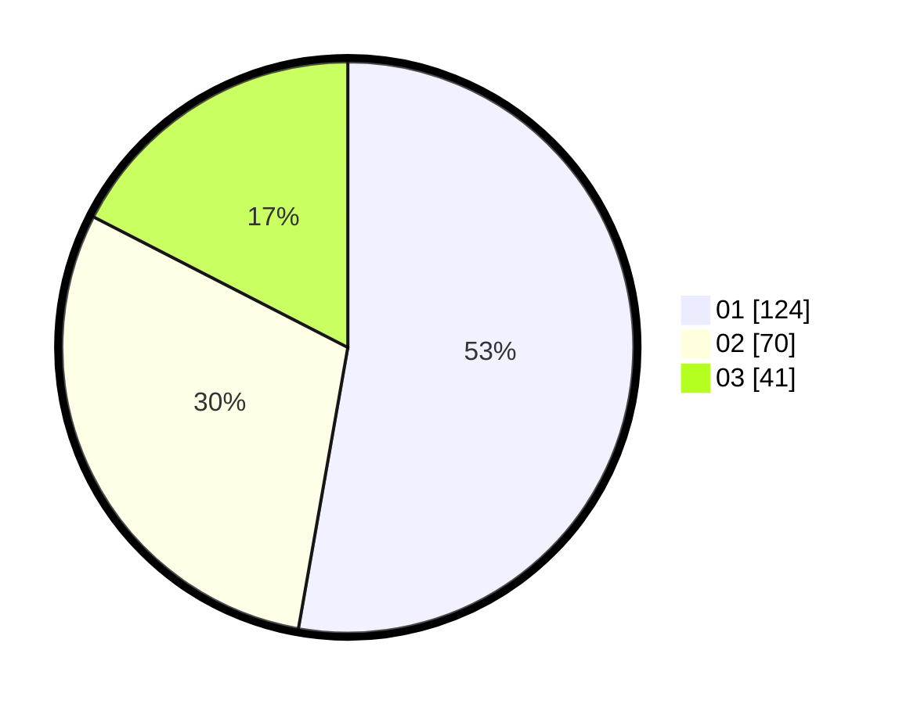

# Hasil

Hasil perolehan suara paslon dapat dilihat pada file paslon-01.txt, paslon-02.txt, dan paslon-03.txt.

Jika tidak ada, artinya data tersebut belum ada pada SIREKAP.

## Perolehan Suara

 * Paslon 01: **124**.
 * Paslon 02: **70**.
 * Paslon 03: **41**.

## Foto C Plano

https://sirekap-obj-formc.kpu.go.id/5c27/pemilu/ppwp/31/75/02/10/05/3175021005099-20240215-193527--22811635-1b4e-49b4-9898-2957e168b015.jpg

https://sirekap-obj-formc.kpu.go.id/5c27/pemilu/ppwp/31/75/02/10/05/3175021005099-20240215-193549--b77e906c-e9e6-4c9f-b340-f1f1fd58b6db.jpg

https://sirekap-obj-formc.kpu.go.id/5c27/pemilu/ppwp/31/75/02/10/05/3175021005099-20240215-193538--d7aa7d75-c50b-425c-94a1-86ad1bab3394.jpg

## DATA PEMILIH TETAP

Jumlah pemilih dalam DPT: **289**.
 * L: **132**.
 * P: **157**.

## DATA PENGGUNA HAK PILIH

Jumlah pengguna hak pilih dalam DPT: **232**.
 * L: **101**.
 * P: **131**.

Jumlah pengguna hak pilih dalam DPTb: **5**.
 * L: **2**.
 * P: **3**.

Jumlah pengguna hak pilih dalam DPK: **1**.
 * L: **0**.
 * P: **1**.

Jumlah pengguna hak pilih: **238**.
 * L: **103**.
 * P: **135**.

## JUMLAH SUARA SAH DAN TIDAK SAH

JUMLAH SELURUH SUARA SAH: **235**.

JUMLAH SUARA TIDAK SAH: **3**.

JUMLAH SELURUH SUARA SAH DAN SUARA TIDAK SAH: **238**.
