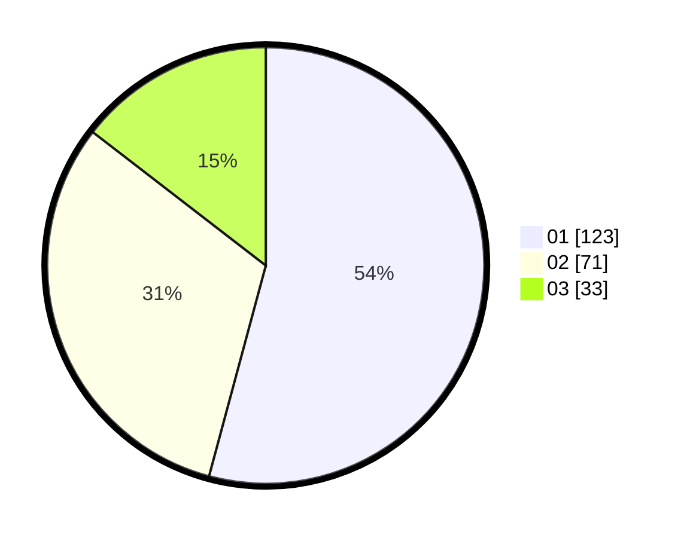

# Hasil

Hasil perolehan suara paslon dapat dilihat pada file paslon-01.txt, paslon-02.txt, dan paslon-03.txt.

Jika tidak ada, artinya data tersebut belum ada pada SIREKAP.

## Perolehan Suara

 * Paslon 01: **123**.
 * Paslon 02: **71**.
 * Paslon 03: **33**.

## Foto C Plano

https://sirekap-obj-formc.kpu.go.id/6193/pemilu/ppwp/31/75/02/10/05/3175021005103-20240214-182600--8e5d2c79-5f66-4466-a436-bf8b4676fbc6.jpg

https://sirekap-obj-formc.kpu.go.id/6193/pemilu/ppwp/31/75/02/10/05/3175021005103-20240214-182622--e4e7fcef-f7de-4043-ae8c-f4f16ef0838d.jpg

https://sirekap-obj-formc.kpu.go.id/6193/pemilu/ppwp/31/75/02/10/05/3175021005103-20240214-182611--7b71f717-bb2b-4749-865c-592aa6f96cc8.jpg

## DATA PEMILIH TETAP

Jumlah pemilih dalam DPT: **288**.
 * L: **135**.
 * P: **153**.

## DATA PENGGUNA HAK PILIH

Jumlah pengguna hak pilih dalam DPT: **226**.
 * L: **98**.
 * P: **128**.

Jumlah pengguna hak pilih dalam DPTb: **4**.
 * L: **2**.
 * P: **2**.

Jumlah pengguna hak pilih dalam DPK: **2**.
 * L: **0**.
 * P: **2**.

Jumlah pengguna hak pilih: **232**.
 * L: **100**.
 * P: **132**.

## JUMLAH SUARA SAH DAN TIDAK SAH

JUMLAH SELURUH SUARA SAH: **227**.

JUMLAH SUARA TIDAK SAH: **5**.

JUMLAH SELURUH SUARA SAH DAN SUARA TIDAK SAH: **232**.
