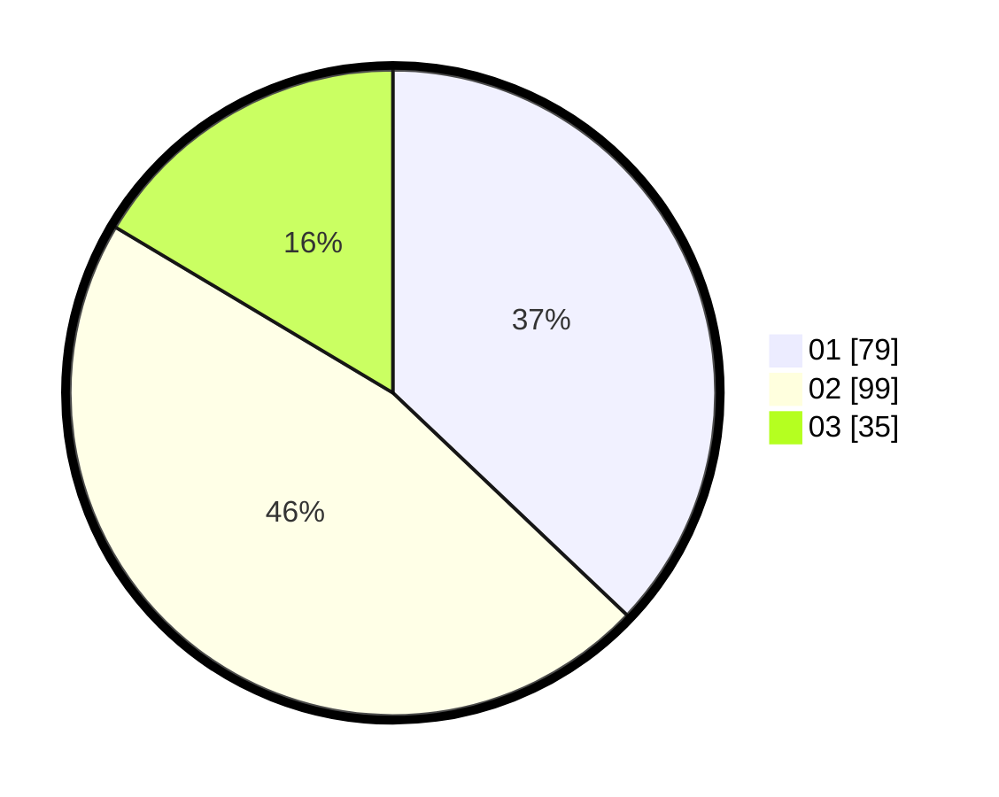

# Hasil

Hasil perolehan suara paslon dapat dilihat pada file paslon-01.txt, paslon-02.txt, dan paslon-03.txt.

Jika tidak ada, artinya data tersebut belum ada pada SIREKAP.

## Perolehan Suara

 * Paslon 01: **79**.
 * Paslon 02: **99**.
 * Paslon 03: **35**.

## Foto C Plano

https://sirekap-obj-formc.kpu.go.id/bd48/pemilu/ppwp/31/75/02/10/05/3175021005106-20240216-000515--8f1b9dae-3fa4-4480-97d9-fddf99fc964d.jpg

https://sirekap-obj-formc.kpu.go.id/bd48/pemilu/ppwp/31/75/02/10/05/3175021005106-20240216-000517--a43a2e73-957f-4c7d-8180-70f503f42ca2.jpg

https://sirekap-obj-formc.kpu.go.id/bd48/pemilu/ppwp/31/75/02/10/05/3175021005106-20240216-000516--b3b7c4c7-0000-48e9-adb2-a5312284546d.jpg

## DATA PEMILIH TETAP

Jumlah pemilih dalam DPT: **259**.
 * L: **113**.
 * P: **146**.

## DATA PENGGUNA HAK PILIH

Jumlah pengguna hak pilih dalam DPT: **207**.
 * L: **82**.
 * P: **125**.

Jumlah pengguna hak pilih dalam DPTb: **4**.
 * L: **3**.
 * P: **1**.

Jumlah pengguna hak pilih dalam DPK: **3**.
 * L: **1**.
 * P: **2**.

Jumlah pengguna hak pilih: **214**.
 * L: **86**.
 * P: **128**.

## JUMLAH SUARA SAH DAN TIDAK SAH

JUMLAH SELURUH SUARA SAH: **213**.

JUMLAH SUARA TIDAK SAH: **1**.

JUMLAH SELURUH SUARA SAH DAN SUARA TIDAK SAH: **214**.
