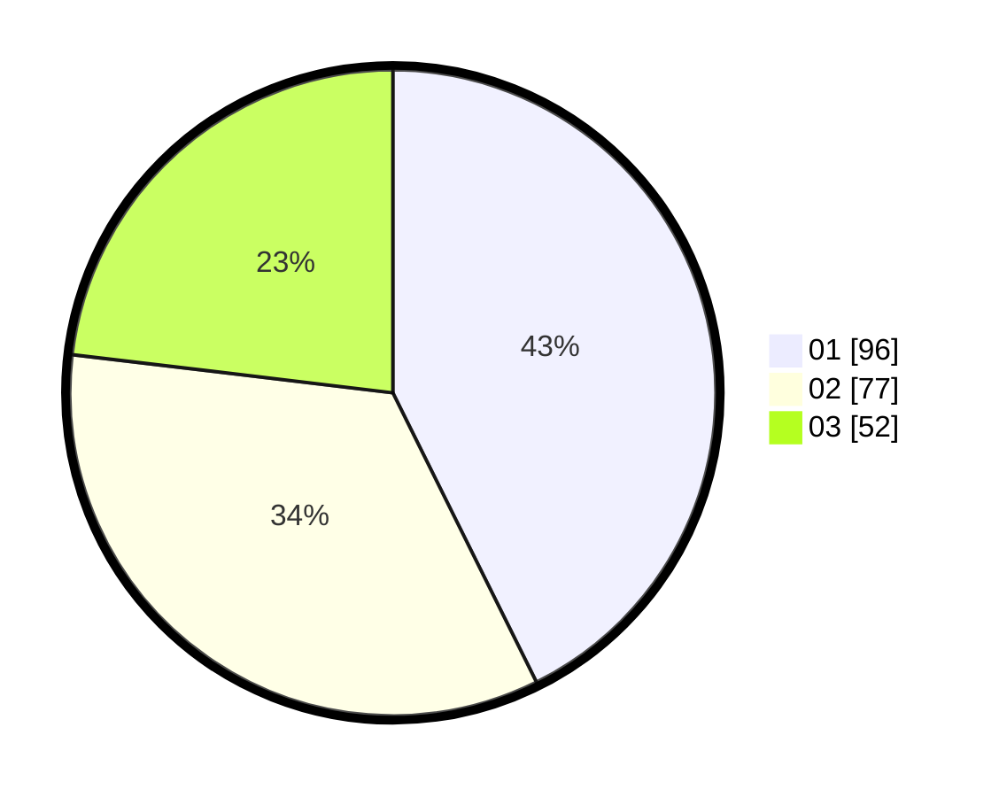

# Hasil

Hasil perolehan suara paslon dapat dilihat pada file paslon-01.txt, paslon-02.txt, dan paslon-03.txt.

Jika tidak ada, artinya data tersebut belum ada pada SIREKAP.

## Perolehan Suara

 * Paslon 01: **96**.
 * Paslon 02: **77**.
 * Paslon 03: **52**.

## Foto C Plano

https://sirekap-obj-formc.kpu.go.id/5967/pemilu/ppwp/31/75/02/10/05/3175021005117-20240215-123400--211aec36-fdfb-4aef-8288-1843b8506d82.jpg

https://sirekap-obj-formc.kpu.go.id/5967/pemilu/ppwp/31/75/02/10/05/3175021005117-20240215-123422--db1bb9cd-e751-489c-8e7e-2f99b7b6114d.jpg

https://sirekap-obj-formc.kpu.go.id/5967/pemilu/ppwp/31/75/02/10/05/3175021005117-20240215-123411--45ae8e94-d94a-462c-b79e-8fb3201a601a.jpg

## DATA PEMILIH TETAP

Jumlah pemilih dalam DPT: **246**.
 * L: **113**.
 * P: **133**.

## DATA PENGGUNA HAK PILIH

Jumlah pengguna hak pilih dalam DPT: **204**.
 * L: **98**.
 * P: **106**.

Jumlah pengguna hak pilih dalam DPTb: **17**.
 * L: **8**.
 * P: **9**.

Jumlah pengguna hak pilih dalam DPK: **4**.
 * L: **2**.
 * P: **2**.

Jumlah pengguna hak pilih: **225**.
 * L: **108**.
 * P: **117**.

## JUMLAH SUARA SAH DAN TIDAK SAH

JUMLAH SELURUH SUARA SAH: **225**.

JUMLAH SUARA TIDAK SAH: **0**.

JUMLAH SELURUH SUARA SAH DAN SUARA TIDAK SAH: **225**.
