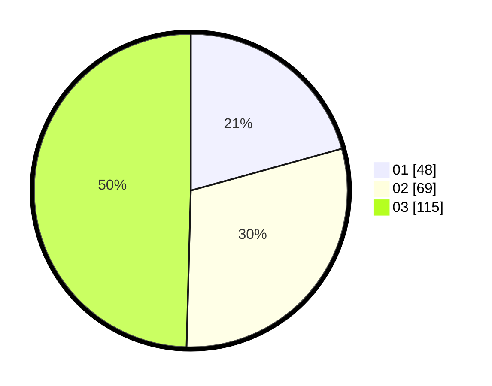

# Hasil

Hasil perolehan suara paslon dapat dilihat pada file paslon-01.txt, paslon-02.txt, dan paslon-03.txt.

Jika tidak ada, artinya data tersebut belum ada pada SIREKAP.

## Perolehan Suara

 * Paslon 01: **48**.
 * Paslon 02: **69**.
 * Paslon 03: **115**.

## Foto C Plano

https://sirekap-obj-formc.kpu.go.id/80c2/pemilu/ppwp/31/75/02/10/06/3175021006001-20240214-212343--4c2f8385-733c-42b0-a008-8449849d7041.jpg

https://sirekap-obj-formc.kpu.go.id/80c2/pemilu/ppwp/31/75/02/10/06/3175021006001-20240214-212424--49da6f63-de2d-433a-b123-e02b436c9109.jpg

https://sirekap-obj-formc.kpu.go.id/80c2/pemilu/ppwp/31/75/02/10/06/3175021006001-20240214-212306--3a259a31-c02f-4db2-bac5-4a6158f32967.jpg

## DATA PEMILIH TETAP

Jumlah pemilih dalam DPT: **293**.
 * L: **145**.
 * P: **148**.

## DATA PENGGUNA HAK PILIH

Jumlah pengguna hak pilih dalam DPT: **221**.
 * L: **112**.
 * P: **109**.

Jumlah pengguna hak pilih dalam DPTb: **11**.
 * L: **4**.
 * P: **7**.

Jumlah pengguna hak pilih dalam DPK: **4**.
 * L: **3**.
 * P: **1**.

Jumlah pengguna hak pilih: **236**.
 * L: **119**.
 * P: **117**.

## JUMLAH SUARA SAH DAN TIDAK SAH

JUMLAH SELURUH SUARA SAH: **232**.

JUMLAH SUARA TIDAK SAH: **4**.

JUMLAH SELURUH SUARA SAH DAN SUARA TIDAK SAH: **236**.
