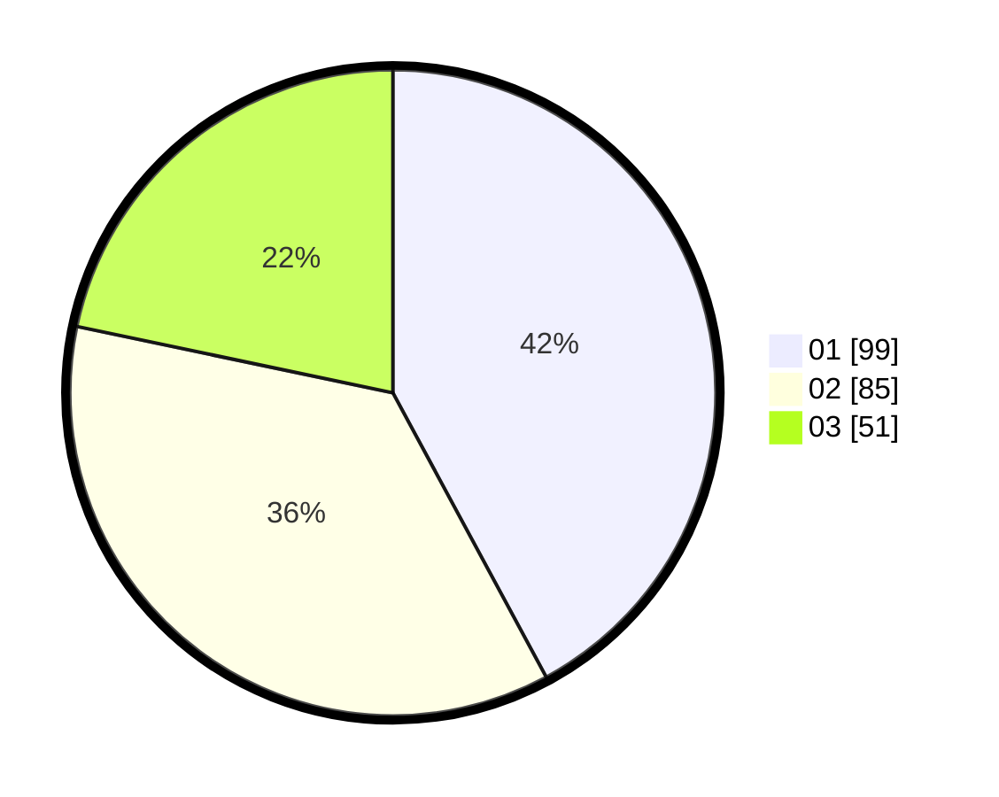

# Hasil

Hasil perolehan suara paslon dapat dilihat pada file paslon-01.txt, paslon-02.txt, dan paslon-03.txt.

Jika tidak ada, artinya data tersebut belum ada pada SIREKAP.

## Perolehan Suara

 * Paslon 01: **99**.
 * Paslon 02: **85**.
 * Paslon 03: **51**.

## Foto C Plano

https://sirekap-obj-formc.kpu.go.id/1d19/pemilu/ppwp/31/75/02/10/06/3175021006003-20240214-184825--cff9165a-a3a4-4eba-bb23-15640e455934.jpg

https://sirekap-obj-formc.kpu.go.id/1d19/pemilu/ppwp/31/75/02/10/06/3175021006003-20240214-184923--27ce01f7-7383-4b58-842c-673338f546a4.jpg

https://sirekap-obj-formc.kpu.go.id/1d19/pemilu/ppwp/31/75/02/10/06/3175021006003-20240214-185010--dc688b63-96da-4ed4-ad26-910754ba1c86.jpg

## DATA PEMILIH TETAP

Jumlah pemilih dalam DPT: **291**.
 * L: **143**.
 * P: **148**.

## DATA PENGGUNA HAK PILIH

Jumlah pengguna hak pilih dalam DPT: **227**.
 * L: **112**.
 * P: **115**.

Jumlah pengguna hak pilih dalam DPTb: **14**.
 * L: **4**.
 * P: **10**.

Jumlah pengguna hak pilih dalam DPK: **7**.
 * L: **3**.
 * P: **4**.

Jumlah pengguna hak pilih: **248**.
 * L: **119**.
 * P: **129**.

## JUMLAH SUARA SAH DAN TIDAK SAH

JUMLAH SELURUH SUARA SAH: **235**.

JUMLAH SUARA TIDAK SAH: **13**.

JUMLAH SELURUH SUARA SAH DAN SUARA TIDAK SAH: **248**.
