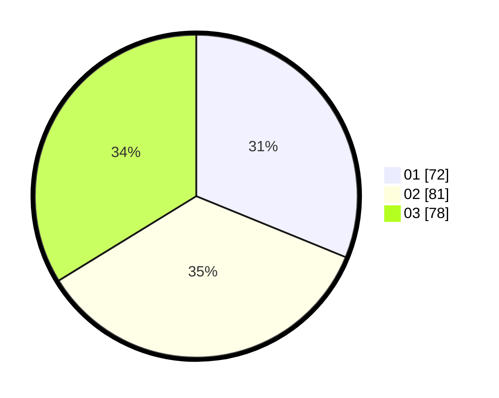

# Hasil

Hasil perolehan suara paslon dapat dilihat pada file paslon-01.txt, paslon-02.txt, dan paslon-03.txt.

Jika tidak ada, artinya data tersebut belum ada pada SIREKAP.

## Perolehan Suara

 * Paslon 01: **72**.
 * Paslon 02: **81**.
 * Paslon 03: **78**.

## Foto C Plano

https://sirekap-obj-formc.kpu.go.id/2c78/pemilu/ppwp/31/75/02/10/06/3175021006006-20240214-203728--02ffaa5e-e72c-4a0c-bf85-1a89e38293d3.jpg

https://sirekap-obj-formc.kpu.go.id/2c78/pemilu/ppwp/31/75/02/10/06/3175021006006-20240215-000308--afbf8bd4-fb63-42bf-adad-a4a64a3cef05.jpg

https://sirekap-obj-formc.kpu.go.id/2c78/pemilu/ppwp/31/75/02/10/06/3175021006006-20240215-000519--8801eaaa-8bfa-4465-999f-35c961546ea5.jpg

## DATA PEMILIH TETAP

Jumlah pemilih dalam DPT: **292**.
 * L: **143**.
 * P: **149**.

## DATA PENGGUNA HAK PILIH

Jumlah pengguna hak pilih dalam DPT: **228**.
 * L: **110**.
 * P: **118**.

Jumlah pengguna hak pilih dalam DPTb: **3**.
 * L: **2**.
 * P: **1**.

Jumlah pengguna hak pilih dalam DPK: **4**.
 * L: **2**.
 * P: **2**.

Jumlah pengguna hak pilih: **235**.
 * L: **114**.
 * P: **121**.

## JUMLAH SUARA SAH DAN TIDAK SAH

JUMLAH SELURUH SUARA SAH: **231**.

JUMLAH SUARA TIDAK SAH: **4**.

JUMLAH SELURUH SUARA SAH DAN SUARA TIDAK SAH: **235**.
