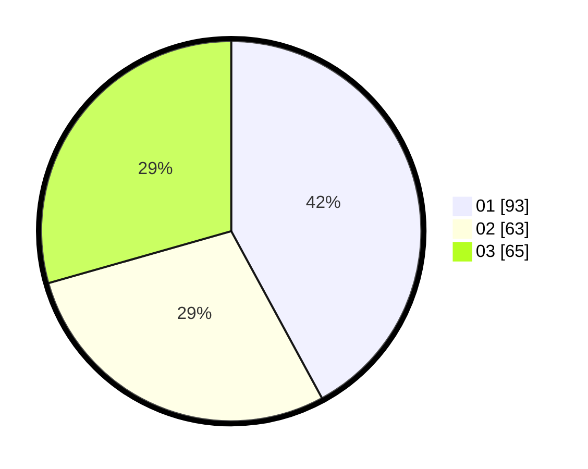

# Hasil

Hasil perolehan suara paslon dapat dilihat pada file paslon-01.txt, paslon-02.txt, dan paslon-03.txt.

Jika tidak ada, artinya data tersebut belum ada pada SIREKAP.

## Perolehan Suara

 * Paslon 01: **93**.
 * Paslon 02: **63**.
 * Paslon 03: **65**.

## Foto C Plano

https://sirekap-obj-formc.kpu.go.id/cec1/pemilu/ppwp/31/75/02/10/06/3175021006010-20240214-175443--3644165d-3f27-436c-929e-eef426d2e15f.jpg

https://sirekap-obj-formc.kpu.go.id/cec1/pemilu/ppwp/31/75/02/10/06/3175021006010-20240214-175443--f7e73a08-c124-4096-9a40-f716a45a63b8.jpg

https://sirekap-obj-formc.kpu.go.id/cec1/pemilu/ppwp/31/75/02/10/06/3175021006010-20240214-175443--f36b1112-a7cd-4f23-ae17-0c34a35567e3.jpg

## DATA PEMILIH TETAP

Jumlah pemilih dalam DPT: **272**.
 * L: **119**.
 * P: **153**.

## DATA PENGGUNA HAK PILIH

Jumlah pengguna hak pilih dalam DPT: **215**.
 * L: **92**.
 * P: **123**.

Jumlah pengguna hak pilih dalam DPTb: **5**.
 * L: **4**.
 * P: **1**.

Jumlah pengguna hak pilih dalam DPK: **2**.
 * L: **2**.
 * P: **0**.

Jumlah pengguna hak pilih: **222**.
 * L: **98**.
 * P: **124**.

## JUMLAH SUARA SAH DAN TIDAK SAH

JUMLAH SELURUH SUARA SAH: **221**.

JUMLAH SUARA TIDAK SAH: **1**.

JUMLAH SELURUH SUARA SAH DAN SUARA TIDAK SAH: **222**.
