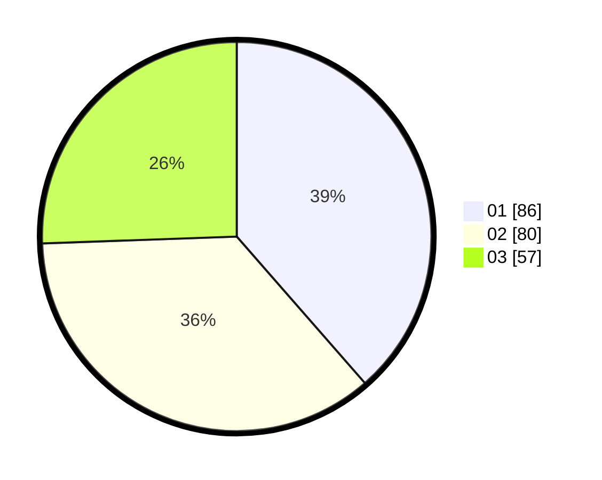

# Hasil

Hasil perolehan suara paslon dapat dilihat pada file paslon-01.txt, paslon-02.txt, dan paslon-03.txt.

Jika tidak ada, artinya data tersebut belum ada pada SIREKAP.

## Perolehan Suara

 * Paslon 01: **86**.
 * Paslon 02: **80**.
 * Paslon 03: **57**.

## Foto C Plano

https://sirekap-obj-formc.kpu.go.id/95e6/pemilu/ppwp/31/75/02/10/06/3175021006021-20240214-205205--8396811e-31a0-4ed1-93b4-356492ca4daa.jpg

https://sirekap-obj-formc.kpu.go.id/95e6/pemilu/ppwp/31/75/02/10/06/3175021006021-20240214-211555--45c4751e-67cc-4089-ad48-f41173893e3d.jpg

https://sirekap-obj-formc.kpu.go.id/95e6/pemilu/ppwp/31/75/02/10/06/3175021006021-20240216-173626--ea751305-9e22-4702-8a98-7255f102e24c.jpg

## DATA PEMILIH TETAP

Jumlah pemilih dalam DPT: **295**.
 * L: **141**.
 * P: **154**.

## DATA PENGGUNA HAK PILIH

Jumlah pengguna hak pilih dalam DPT: **216**.
 * L: **96**.
 * P: **120**.

Jumlah pengguna hak pilih dalam DPTb: **4**.
 * L: **2**.
 * P: **2**.

Jumlah pengguna hak pilih dalam DPK: **5**.
 * L: **5**.
 * P: **0**.

Jumlah pengguna hak pilih: **225**.
 * L: **103**.
 * P: **122**.

## JUMLAH SUARA SAH DAN TIDAK SAH

JUMLAH SELURUH SUARA SAH: **223**.

JUMLAH SUARA TIDAK SAH: **2**.

JUMLAH SELURUH SUARA SAH DAN SUARA TIDAK SAH: **225**.
