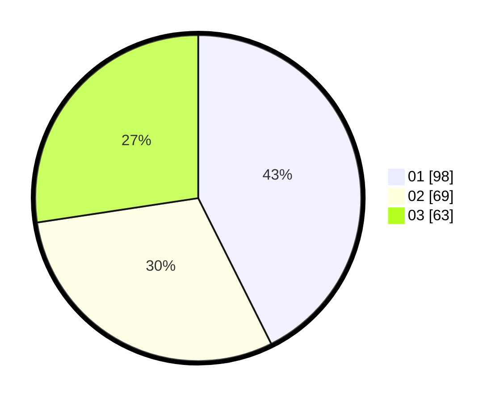

# Hasil

Hasil perolehan suara paslon dapat dilihat pada file paslon-01.txt, paslon-02.txt, dan paslon-03.txt.

Jika tidak ada, artinya data tersebut belum ada pada SIREKAP.

## Perolehan Suara

 * Paslon 01: **98**.
 * Paslon 02: **69**.
 * Paslon 03: **63**.

## Foto C Plano

https://sirekap-obj-formc.kpu.go.id/baaf/pemilu/ppwp/31/75/02/10/06/3175021006025-20240214-215339--ff80acaf-fee9-44a6-9da6-533465ce86a0.jpg

https://sirekap-obj-formc.kpu.go.id/baaf/pemilu/ppwp/31/75/02/10/06/3175021006025-20240214-215525--33c10674-015f-4f67-91a1-a8eecbadf69a.jpg

https://sirekap-obj-formc.kpu.go.id/baaf/pemilu/ppwp/31/75/02/10/06/3175021006025-20240214-215654--46b43a41-bdd7-4652-945e-f80fcdab20b5.jpg
