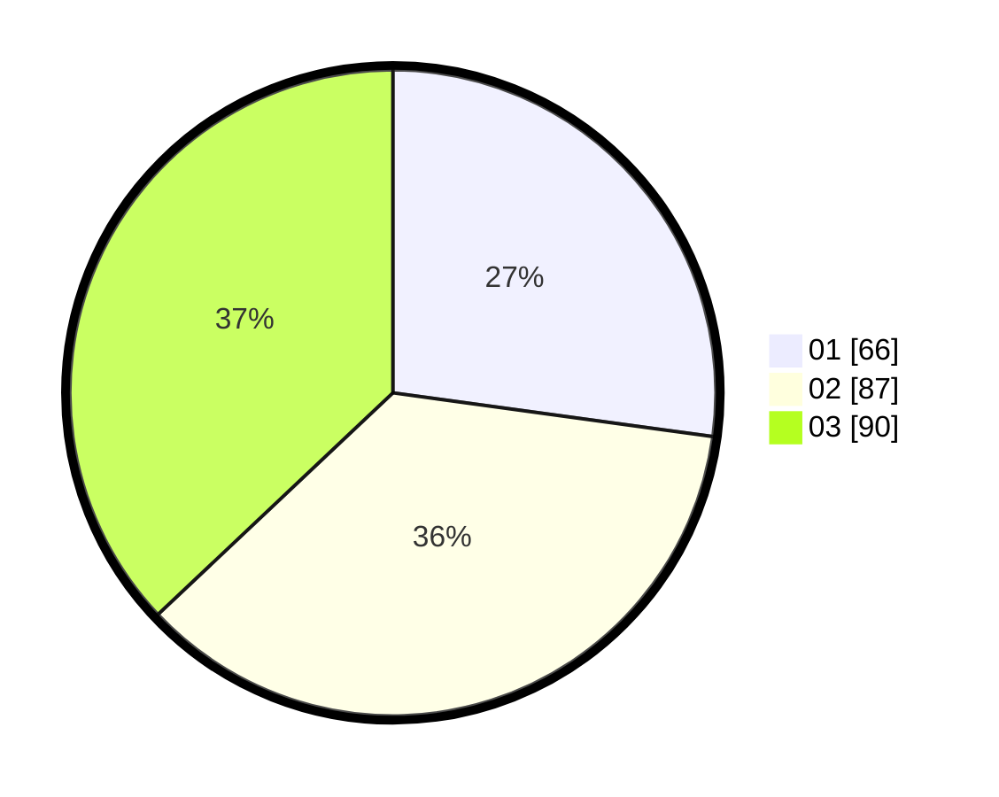

# Hasil

Hasil perolehan suara paslon dapat dilihat pada file paslon-01.txt, paslon-02.txt, dan paslon-03.txt.

Jika tidak ada, artinya data tersebut belum ada pada SIREKAP.

## Perolehan Suara

 * Paslon 01: **66**.
 * Paslon 02: **87**.
 * Paslon 03: **90**.

## Foto C Plano

https://sirekap-obj-formc.kpu.go.id/0442/pemilu/ppwp/31/75/02/10/06/3175021006026-20240215-013126--9c55d0ea-5dd3-4343-a81c-bcde6e0d09d2.jpg

https://sirekap-obj-formc.kpu.go.id/0442/pemilu/ppwp/31/75/02/10/06/3175021006026-20240215-013305--443722a8-3ffa-4806-82b0-4748bb3c2563.jpg

https://sirekap-obj-formc.kpu.go.id/0442/pemilu/ppwp/31/75/02/10/06/3175021006026-20240215-013412--f2355ffb-9385-445d-a16e-2c99157cca63.jpg

## DATA PEMILIH TETAP

Jumlah pemilih dalam DPT: **300**.
 * L: **157**.
 * P: **143**.

## DATA PENGGUNA HAK PILIH

Jumlah pengguna hak pilih dalam DPT: **234**.
 * L: **116**.
 * P: **118**.

Jumlah pengguna hak pilih dalam DPTb: **11**.
 * L: **5**.
 * P: **6**.

Jumlah pengguna hak pilih dalam DPK: **0**.
 * L: **0**.
 * P: **0**.

Jumlah pengguna hak pilih: **245**.
 * L: **121**.
 * P: **124**.

## JUMLAH SUARA SAH DAN TIDAK SAH

JUMLAH SELURUH SUARA SAH: **243**.

JUMLAH SUARA TIDAK SAH: **2**.

JUMLAH SELURUH SUARA SAH DAN SUARA TIDAK SAH: **245**.
