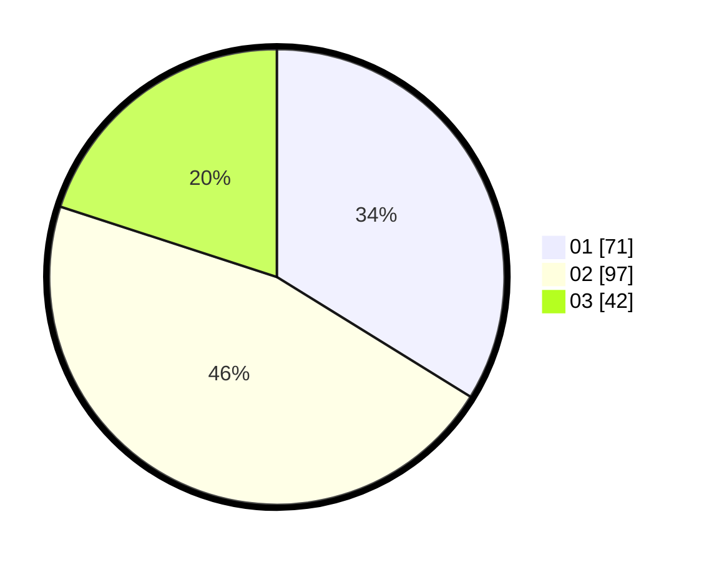

# Hasil

Hasil perolehan suara paslon dapat dilihat pada file paslon-01.txt, paslon-02.txt, dan paslon-03.txt.

Jika tidak ada, artinya data tersebut belum ada pada SIREKAP.

## Perolehan Suara

 * Paslon 01: **71**.
 * Paslon 02: **97**.
 * Paslon 03: **42**.

## Foto C Plano

https://sirekap-obj-formc.kpu.go.id/8aee/pemilu/ppwp/31/75/02/10/06/3175021006028-20240214-192745--22167403-9d1b-43bc-98c5-37bf2a7c523f.jpg

https://sirekap-obj-formc.kpu.go.id/8aee/pemilu/ppwp/31/75/02/10/06/3175021006028-20240214-193154--8e0dc57e-35de-43fe-b3f3-216d6d93d960.jpg

https://sirekap-obj-formc.kpu.go.id/8aee/pemilu/ppwp/31/75/02/10/06/3175021006028-20240214-191844--9c27a400-0907-497a-bf8e-8373ab0bc854.jpg

## DATA PEMILIH TETAP

Jumlah pemilih dalam DPT: **285**.
 * L: **126**.
 * P: **159**.

## DATA PENGGUNA HAK PILIH

Jumlah pengguna hak pilih dalam DPT: **205**.
 * L: **86**.
 * P: **119**.

Jumlah pengguna hak pilih dalam DPTb: **6**.
 * L: **3**.
 * P: **3**.

Jumlah pengguna hak pilih dalam DPK: **2**.
 * L: **2**.
 * P: **0**.

Jumlah pengguna hak pilih: **213**.
 * L: **91**.
 * P: **122**.

## JUMLAH SUARA SAH DAN TIDAK SAH

JUMLAH SELURUH SUARA SAH: **210**.

JUMLAH SUARA TIDAK SAH: **3**.

JUMLAH SELURUH SUARA SAH DAN SUARA TIDAK SAH: **213**.
