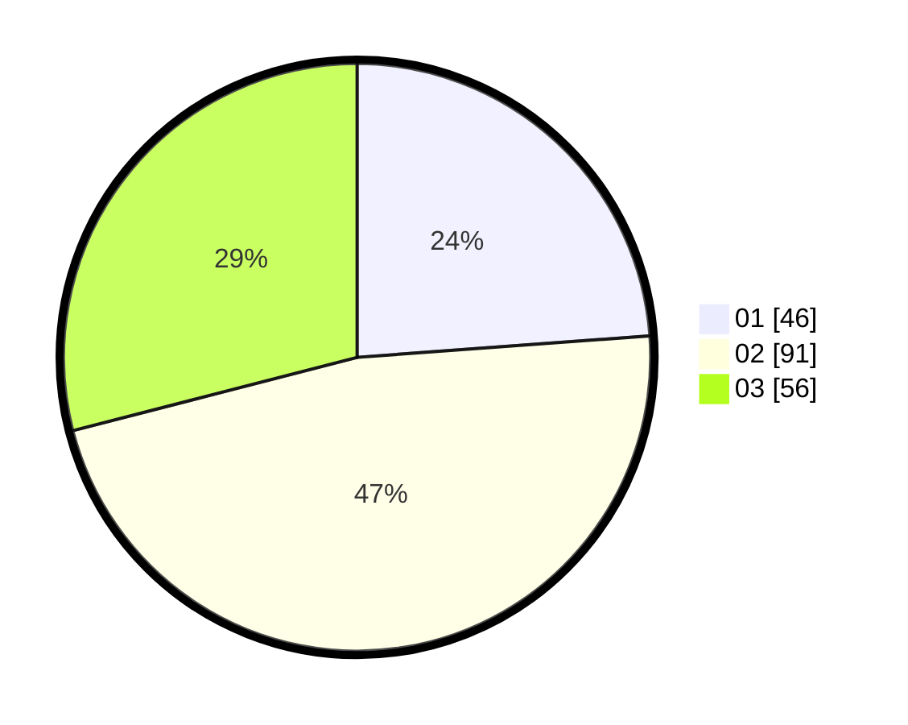

# Hasil

Hasil perolehan suara paslon dapat dilihat pada file paslon-01.txt, paslon-02.txt, dan paslon-03.txt.

Jika tidak ada, artinya data tersebut belum ada pada SIREKAP.

## Perolehan Suara

 * Paslon 01: **46**.
 * Paslon 02: **91**.
 * Paslon 03: **56**.

## Foto C Plano

https://sirekap-obj-formc.kpu.go.id/e894/pemilu/ppwp/31/75/02/10/06/3175021006062-20240214-205838--adf48e3d-0a4c-4ff6-8f25-b744707e0d7e.jpg

https://sirekap-obj-formc.kpu.go.id/e894/pemilu/ppwp/31/75/02/10/06/3175021006062-20240214-210021--8ac116ec-cc91-4289-a9cf-70a248bc6a23.jpg
