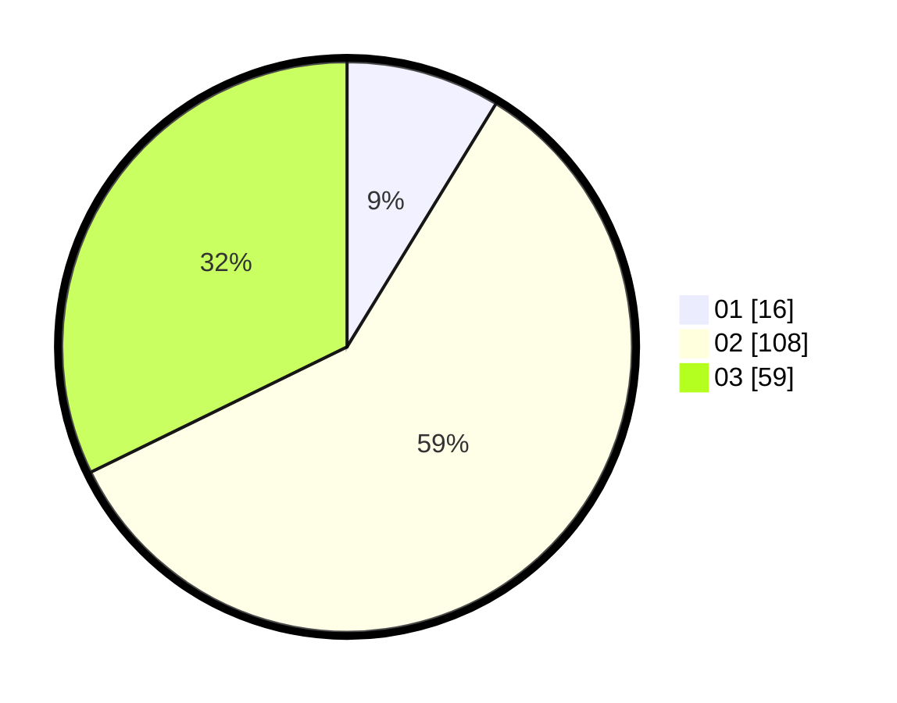

# Hasil

Hasil perolehan suara paslon dapat dilihat pada file paslon-01.txt, paslon-02.txt, dan paslon-03.txt.

Jika tidak ada, artinya data tersebut belum ada pada SIREKAP.

## Perolehan Suara

 * Paslon 01: **16**.
 * Paslon 02: **108**.
 * Paslon 03: **59**.

## Foto C Plano

https://sirekap-obj-formc.kpu.go.id/b531/pemilu/ppwp/31/75/02/10/06/3175021006063-20240214-185709--ba0c0419-fd27-4caf-864e-db2d04559136.jpg

https://sirekap-obj-formc.kpu.go.id/b531/pemilu/ppwp/31/75/02/10/06/3175021006063-20240214-155424--af8d9798-eb0d-45dd-b9dd-20d8956f903b.jpg

https://sirekap-obj-formc.kpu.go.id/b531/pemilu/ppwp/31/75/02/10/06/3175021006063-20240214-155737--29e3cb9a-fd6e-48e4-bd4f-073ca32673c7.jpg

## DATA PEMILIH TETAP

Jumlah pemilih dalam DPT: **186**.
 * L: **87**.
 * P: **99**.

## DATA PENGGUNA HAK PILIH

Jumlah pengguna hak pilih dalam DPT: **180**.
 * L: **84**.
 * P: **96**.

Jumlah pengguna hak pilih dalam DPTb: **3**.
 * L: **2**.
 * P: **1**.

Jumlah pengguna hak pilih dalam DPK: **3**.
 * L: **1**.
 * P: **2**.

Jumlah pengguna hak pilih: **186**.
 * L: **87**.
 * P: **99**.

## JUMLAH SUARA SAH DAN TIDAK SAH

JUMLAH SELURUH SUARA SAH: **183**.

JUMLAH SUARA TIDAK SAH: **3**.

JUMLAH SELURUH SUARA SAH DAN SUARA TIDAK SAH: **186**.
