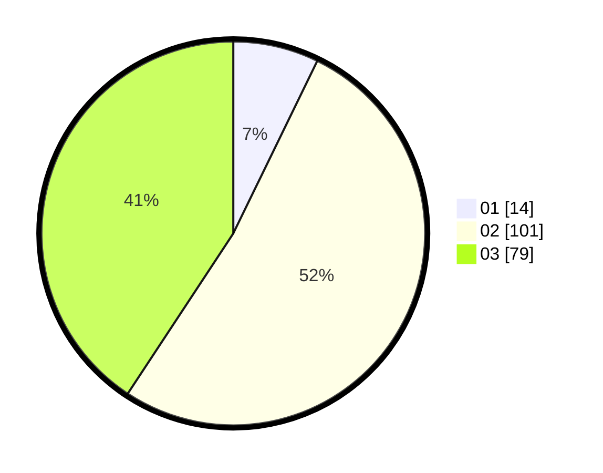

# Hasil

Hasil perolehan suara paslon dapat dilihat pada file paslon-01.txt, paslon-02.txt, dan paslon-03.txt.

Jika tidak ada, artinya data tersebut belum ada pada SIREKAP.

## Perolehan Suara

 * Paslon 01: **14**.
 * Paslon 02: **101**.
 * Paslon 03: **79**.

## Foto C Plano

https://sirekap-obj-formc.kpu.go.id/eb67/pemilu/ppwp/31/75/02/10/06/3175021006064-20240214-235232--93f055b6-03e0-4392-8689-9f4ad0ccc7f8.jpg

https://sirekap-obj-formc.kpu.go.id/eb67/pemilu/ppwp/31/75/02/10/06/3175021006064-20240214-235343--ac7f9102-0e05-4b51-adbb-54b09afc86f6.jpg

https://sirekap-obj-formc.kpu.go.id/eb67/pemilu/ppwp/31/75/02/10/06/3175021006064-20240214-235438--fb2ef34f-6006-4c76-b7bc-c4ed7b4e6f74.jpg

## DATA PEMILIH TETAP

Jumlah pemilih dalam DPT: **276**.
 * L: **136**.
 * P: **140**.

## DATA PENGGUNA HAK PILIH

Jumlah pengguna hak pilih dalam DPT: **191**.
 * L: **86**.
 * P: **105**.

Jumlah pengguna hak pilih dalam DPTb: **4**.
 * L: **2**.
 * P: **2**.

Jumlah pengguna hak pilih dalam DPK: **0**.
 * L: **0**.
 * P: **0**.

Jumlah pengguna hak pilih: **195**.
 * L: **88**.
 * P: **107**.

## JUMLAH SUARA SAH DAN TIDAK SAH

JUMLAH SELURUH SUARA SAH: **194**.

JUMLAH SUARA TIDAK SAH: **1**.

JUMLAH SELURUH SUARA SAH DAN SUARA TIDAK SAH: **195**.
