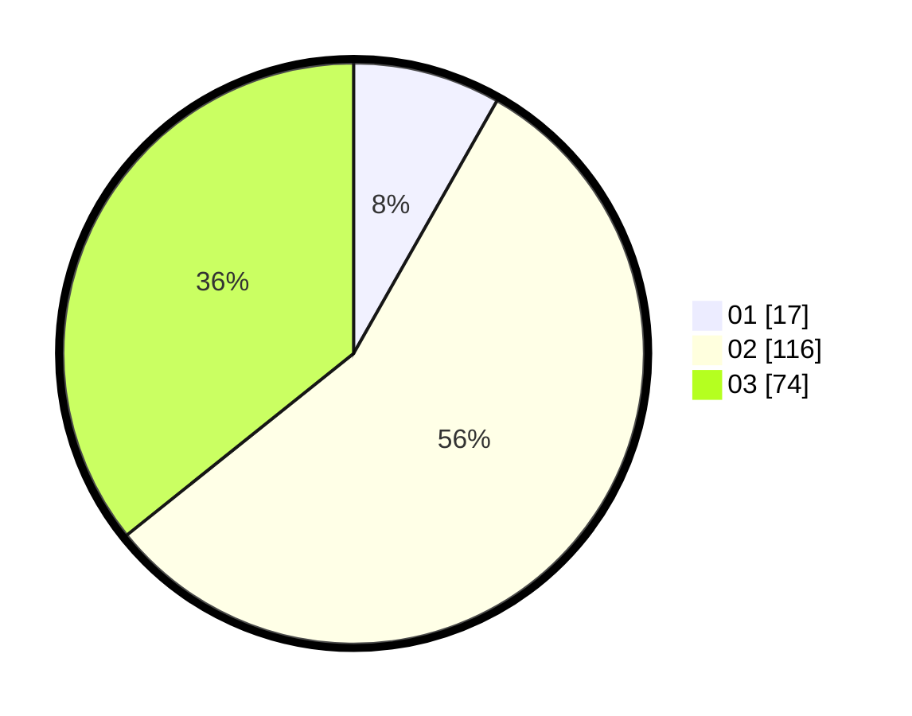

# Hasil

Hasil perolehan suara paslon dapat dilihat pada file paslon-01.txt, paslon-02.txt, dan paslon-03.txt.

Jika tidak ada, artinya data tersebut belum ada pada SIREKAP.

## Perolehan Suara

 * Paslon 01: **17**.
 * Paslon 02: **116**.
 * Paslon 03: **74**.

## Foto C Plano

https://sirekap-obj-formc.kpu.go.id/1430/pemilu/ppwp/31/75/02/10/06/3175021006065-20240214-220929--70e33c19-fd0e-4719-b107-729a9f0fa813.jpg

https://sirekap-obj-formc.kpu.go.id/1430/pemilu/ppwp/31/75/02/10/06/3175021006065-20240214-220954--d39b239a-c8fe-4ffc-a308-9b6f0a50ceb6.jpg

https://sirekap-obj-formc.kpu.go.id/1430/pemilu/ppwp/31/75/02/10/06/3175021006065-20240214-221020--1f0b9db6-30f8-44bf-99f8-47f32ca6ba4c.jpg

## DATA PEMILIH TETAP

Jumlah pemilih dalam DPT: **209**.
 * L: **96**.
 * P: **113**.

## DATA PENGGUNA HAK PILIH

Jumlah pengguna hak pilih dalam DPT: **202**.
 * L: **94**.
 * P: **108**.

Jumlah pengguna hak pilih dalam DPTb: **6**.
 * L: **2**.
 * P: **4**.

Jumlah pengguna hak pilih dalam DPK: **1**.
 * L: **0**.
 * P: **1**.

Jumlah pengguna hak pilih: **209**.
 * L: **96**.
 * P: **113**.

## JUMLAH SUARA SAH DAN TIDAK SAH

JUMLAH SELURUH SUARA SAH: **207**.

JUMLAH SUARA TIDAK SAH: **2**.

JUMLAH SELURUH SUARA SAH DAN SUARA TIDAK SAH: **209**.
