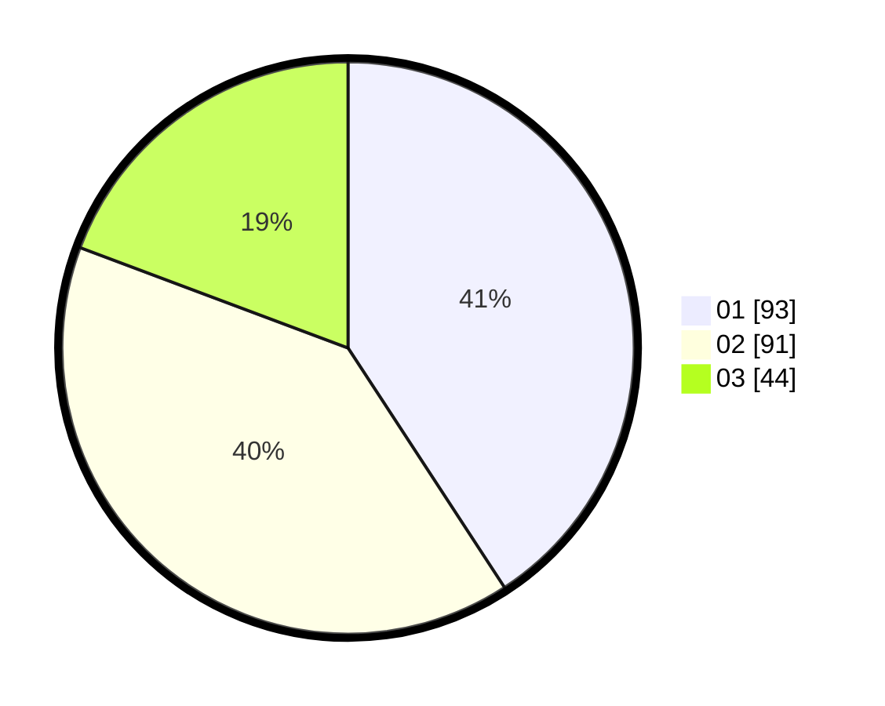

# Hasil

Hasil perolehan suara paslon dapat dilihat pada file paslon-01.txt, paslon-02.txt, dan paslon-03.txt.

Jika tidak ada, artinya data tersebut belum ada pada SIREKAP.

## Perolehan Suara

 * Paslon 01: **93**.
 * Paslon 02: **91**.
 * Paslon 03: **44**.

## Foto C Plano

https://sirekap-obj-formc.kpu.go.id/480e/pemilu/ppwp/31/75/02/10/06/3175021006066-20240215-005341--29fa2e32-9ba4-40b9-9745-f7040b4bef66.jpg

https://sirekap-obj-formc.kpu.go.id/480e/pemilu/ppwp/31/75/02/10/06/3175021006066-20240215-005454--693b3359-c259-462a-adff-77e637c857b3.jpg

https://sirekap-obj-formc.kpu.go.id/480e/pemilu/ppwp/31/75/02/10/06/3175021006066-20240217-204204--4f01ac18-a721-4e22-a3eb-764a7542e714.jpg

## DATA PEMILIH TETAP

Jumlah pemilih dalam DPT: **189**.
 * L: **79**.
 * P: **110**.

## DATA PENGGUNA HAK PILIH

Jumlah pengguna hak pilih dalam DPT: **189**.
 * L: **79**.
 * P: **110**.

Jumlah pengguna hak pilih dalam DPTb: **2**.
 * L: **1**.
 * P: **1**.

Jumlah pengguna hak pilih dalam DPK: **1**.
 * L: **1**.
 * P: **0**.

Jumlah pengguna hak pilih: **192**.
 * L: **81**.
 * P: **111**.

## JUMLAH SUARA SAH DAN TIDAK SAH

JUMLAH SELURUH SUARA SAH: **188**.

JUMLAH SUARA TIDAK SAH: **4**.

JUMLAH SELURUH SUARA SAH DAN SUARA TIDAK SAH: **192**.
