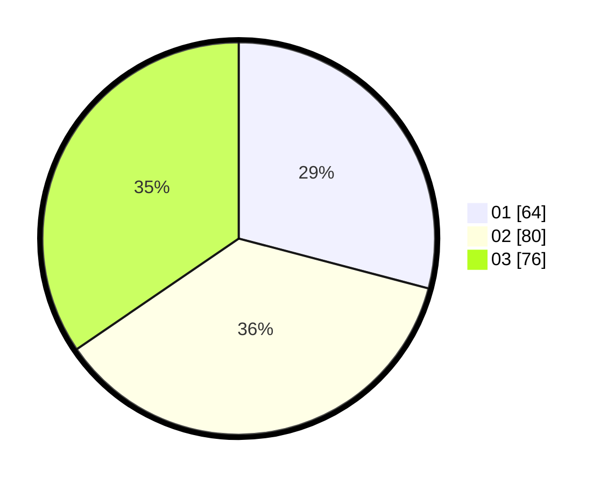

# Hasil

Hasil perolehan suara paslon dapat dilihat pada file paslon-01.txt, paslon-02.txt, dan paslon-03.txt.

Jika tidak ada, artinya data tersebut belum ada pada SIREKAP.

## Perolehan Suara

 * Paslon 01: **64**.
 * Paslon 02: **80**.
 * Paslon 03: **76**.

## Foto C Plano

https://sirekap-obj-formc.kpu.go.id/6702/pemilu/ppwp/31/75/02/10/06/3175021006067-20240214-201046--a757ed9c-9d81-49e6-9f02-a947b10aea3d.jpg

https://sirekap-obj-formc.kpu.go.id/6702/pemilu/ppwp/31/75/02/10/06/3175021006067-20240214-201053--7c424d28-4484-44db-996a-7a36e26e8c59.jpg

https://sirekap-obj-formc.kpu.go.id/6702/pemilu/ppwp/31/75/02/10/06/3175021006067-20240214-201059--d1d46088-0a8f-452a-b771-95e74521c920.jpg

## DATA PEMILIH TETAP

Jumlah pemilih dalam DPT: **274**.
 * L: **124**.
 * P: **150**.

## DATA PENGGUNA HAK PILIH

Jumlah pengguna hak pilih dalam DPT: **205**.
 * L: **89**.
 * P: **116**.

Jumlah pengguna hak pilih dalam DPTb: **9**.
 * L: **4**.
 * P: **5**.

Jumlah pengguna hak pilih dalam DPK: **8**.
 * L: **3**.
 * P: **5**.

Jumlah pengguna hak pilih: **222**.
 * L: **96**.
 * P: **126**.

## JUMLAH SUARA SAH DAN TIDAK SAH

JUMLAH SELURUH SUARA SAH: **220**.

JUMLAH SUARA TIDAK SAH: **2**.

JUMLAH SELURUH SUARA SAH DAN SUARA TIDAK SAH: **222**.
