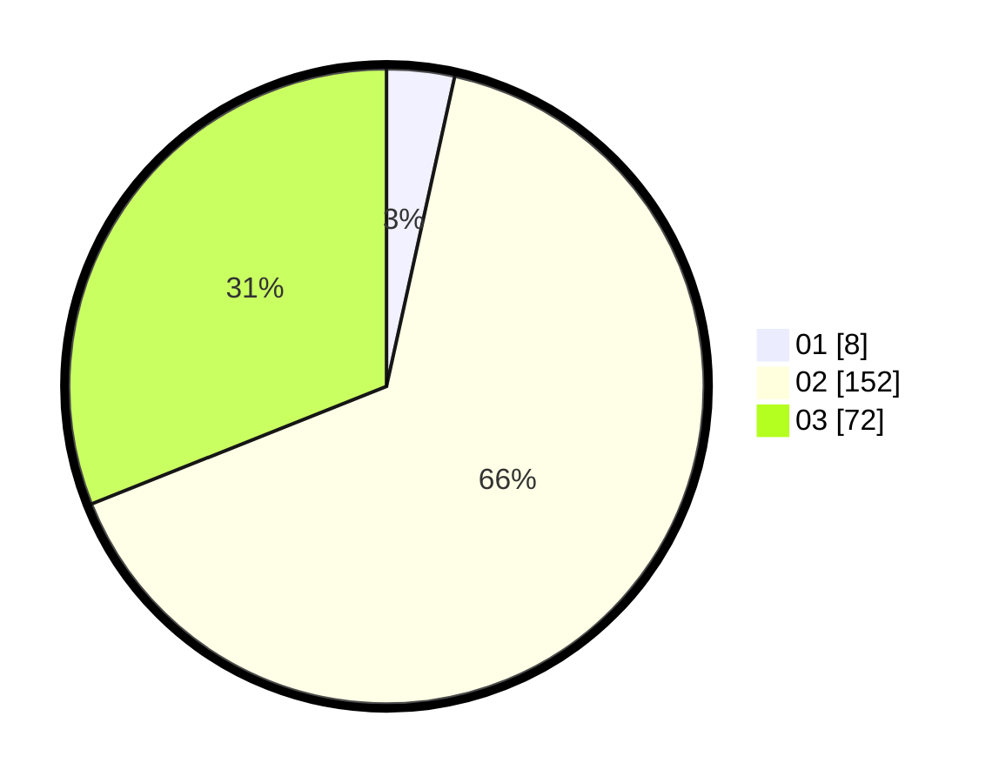

# Hasil

Hasil perolehan suara paslon dapat dilihat pada file paslon-01.txt, paslon-02.txt, dan paslon-03.txt.

Jika tidak ada, artinya data tersebut belum ada pada SIREKAP.

## Perolehan Suara

 * Paslon 01: **8**.
 * Paslon 02: **152**.
 * Paslon 03: **72**.

## Foto C Plano

https://sirekap-obj-formc.kpu.go.id/1978/pemilu/ppwp/31/75/02/10/06/3175021006070-20240215-022229--17779ce2-d78c-488c-9262-7886cada131d.jpg

https://sirekap-obj-formc.kpu.go.id/1978/pemilu/ppwp/31/75/02/10/06/3175021006070-20240215-021909--3bc314e0-4133-4cdb-b91e-5bb85ffdf3a1.jpg

https://sirekap-obj-formc.kpu.go.id/1978/pemilu/ppwp/31/75/02/10/06/3175021006070-20240215-022038--19b6b0ef-6c59-48dd-a01d-83715985add6.jpg

## DATA PEMILIH TETAP

Jumlah pemilih dalam DPT: **277**.
 * L: **133**.
 * P: **144**.

## DATA PENGGUNA HAK PILIH

Jumlah pengguna hak pilih dalam DPT: **197**.
 * L: **108**.
 * P: **89**.

Jumlah pengguna hak pilih dalam DPTb: **5**.
 * L: **2**.
 * P: **3**.

Jumlah pengguna hak pilih dalam DPK: **30**.
 * L: **14**.
 * P: **16**.

Jumlah pengguna hak pilih: **232**.
 * L: **124**.
 * P: **108**.

## JUMLAH SUARA SAH DAN TIDAK SAH

JUMLAH SELURUH SUARA SAH: **232**.

JUMLAH SUARA TIDAK SAH: **1**.

JUMLAH SELURUH SUARA SAH DAN SUARA TIDAK SAH: **233**.
