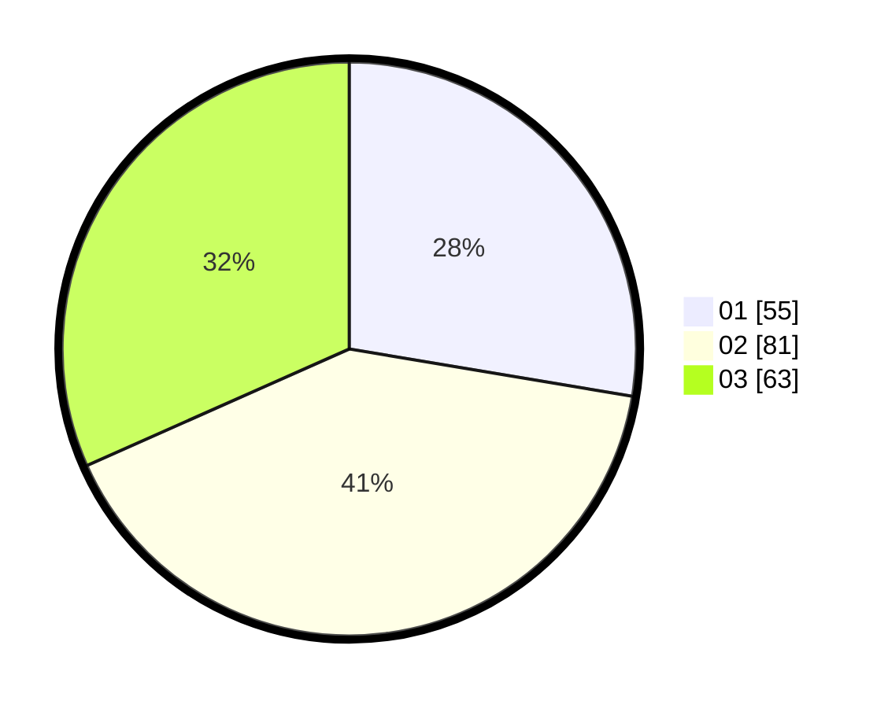

# Hasil

Hasil perolehan suara paslon dapat dilihat pada file paslon-01.txt, paslon-02.txt, dan paslon-03.txt.

Jika tidak ada, artinya data tersebut belum ada pada SIREKAP.

## Perolehan Suara

 * Paslon 01: **55**.
 * Paslon 02: **81**.
 * Paslon 03: **63**.

## Foto C Plano

https://sirekap-obj-formc.kpu.go.id/3d0d/pemilu/ppwp/31/75/02/10/06/3175021006074-20240215-043238--458f97eb-19b5-4e23-a1f4-a1af6bb0fc9d.jpg

https://sirekap-obj-formc.kpu.go.id/3d0d/pemilu/ppwp/31/75/02/10/06/3175021006074-20240215-043307--2a6a6dc2-34e5-4472-8a84-f4eae9668984.jpg

https://sirekap-obj-formc.kpu.go.id/3d0d/pemilu/ppwp/31/75/02/10/06/3175021006074-20240215-043249--77f79e86-65c6-48ba-9635-cb010fa8daea.jpg

## DATA PEMILIH TETAP

Jumlah pemilih dalam DPT: **283**.
 * L: **144**.
 * P: **139**.

## DATA PENGGUNA HAK PILIH

Jumlah pengguna hak pilih dalam DPT: **202**.
 * L: **102**.
 * P: **100**.

Jumlah pengguna hak pilih dalam DPTb: **5**.
 * L: **2**.
 * P: **3**.

Jumlah pengguna hak pilih dalam DPK: **2**.
 * L: **0**.
 * P: **2**.

Jumlah pengguna hak pilih: **209**.
 * L: **104**.
 * P: **105**.

## JUMLAH SUARA SAH DAN TIDAK SAH

JUMLAH SELURUH SUARA SAH: **199**.

JUMLAH SUARA TIDAK SAH: **10**.

JUMLAH SELURUH SUARA SAH DAN SUARA TIDAK SAH: **209**.
