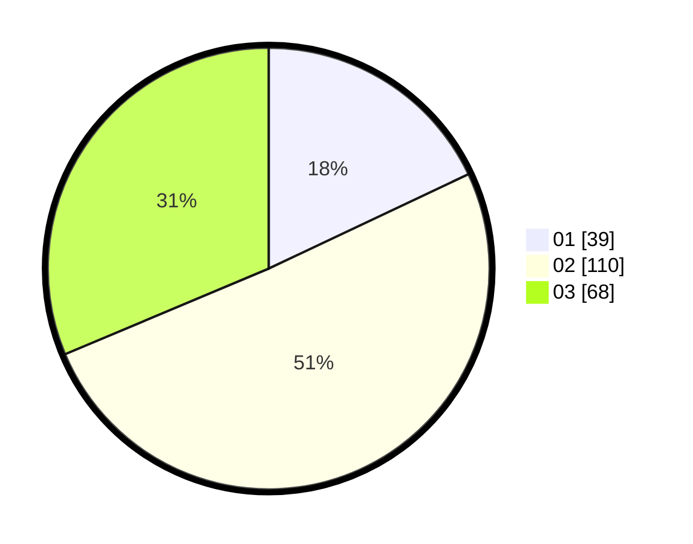

# Hasil

Hasil perolehan suara paslon dapat dilihat pada file paslon-01.txt, paslon-02.txt, dan paslon-03.txt.

Jika tidak ada, artinya data tersebut belum ada pada SIREKAP.

## Perolehan Suara

 * Paslon 01: **39**.
 * Paslon 02: **110**.
 * Paslon 03: **68**.

## Foto C Plano

https://sirekap-obj-formc.kpu.go.id/0317/pemilu/ppwp/31/75/02/10/06/3175021006075-20240214-205640--b58435c8-6781-441e-989e-40f6402a6ccd.jpg

https://sirekap-obj-formc.kpu.go.id/0317/pemilu/ppwp/31/75/02/10/06/3175021006075-20240214-205745--1a53e61e-19ad-4858-8fd8-233ca61f9d64.jpg

https://sirekap-obj-formc.kpu.go.id/0317/pemilu/ppwp/31/75/02/10/06/3175021006075-20240214-205843--bf8b1281-1e9b-466f-94df-5a75c20097c1.jpg

## DATA PEMILIH TETAP

Jumlah pemilih dalam DPT: **285**.
 * L: **122**.
 * P: **163**.

## DATA PENGGUNA HAK PILIH

Jumlah pengguna hak pilih dalam DPT: **209**.
 * L: **86**.
 * P: **123**.

Jumlah pengguna hak pilih dalam DPTb: **9**.
 * L: **4**.
 * P: **5**.

Jumlah pengguna hak pilih dalam DPK: **0**.
 * L: **0**.
 * P: **0**.

Jumlah pengguna hak pilih: **218**.
 * L: **90**.
 * P: **128**.

## JUMLAH SUARA SAH DAN TIDAK SAH

JUMLAH SELURUH SUARA SAH: **217**.

JUMLAH SUARA TIDAK SAH: **1**.

JUMLAH SELURUH SUARA SAH DAN SUARA TIDAK SAH: **218**.
