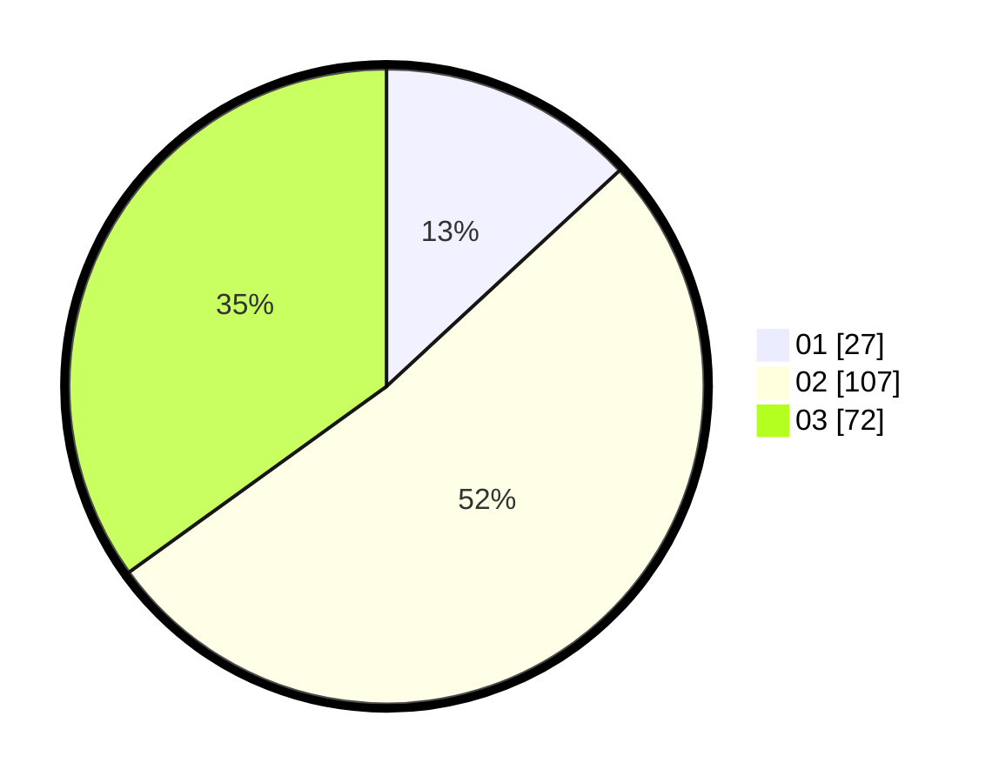

# Hasil

Hasil perolehan suara paslon dapat dilihat pada file paslon-01.txt, paslon-02.txt, dan paslon-03.txt.

Jika tidak ada, artinya data tersebut belum ada pada SIREKAP.

## Perolehan Suara

 * Paslon 01: **27**.
 * Paslon 02: **107**.
 * Paslon 03: **72**.

## Foto C Plano

https://sirekap-obj-formc.kpu.go.id/1df9/pemilu/ppwp/31/75/02/10/06/3175021006078-20240214-184713--ebcff088-d95b-434b-af23-63b3ebd463d0.jpg

https://sirekap-obj-formc.kpu.go.id/1df9/pemilu/ppwp/31/75/02/10/06/3175021006078-20240214-184710--06eba069-2320-43ed-84b6-9986acdff840.jpg

https://sirekap-obj-formc.kpu.go.id/1df9/pemilu/ppwp/31/75/02/10/06/3175021006078-20240214-184705--c88163b6-535c-407d-a3d4-9f1b4a5bb7e9.jpg

## DATA PEMILIH TETAP

Jumlah pemilih dalam DPT: **286**.
 * L: **140**.
 * P: **146**.

## DATA PENGGUNA HAK PILIH

Jumlah pengguna hak pilih dalam DPT: **208**.
 * L: **97**.
 * P: **111**.

Jumlah pengguna hak pilih dalam DPTb: **0**.
 * L: **0**.
 * P: **0**.

Jumlah pengguna hak pilih dalam DPK: **3**.
 * L: **2**.
 * P: **1**.

Jumlah pengguna hak pilih: **211**.
 * L: **99**.
 * P: **112**.

## JUMLAH SUARA SAH DAN TIDAK SAH

JUMLAH SELURUH SUARA SAH: **206**.

JUMLAH SUARA TIDAK SAH: **5**.

JUMLAH SELURUH SUARA SAH DAN SUARA TIDAK SAH: **211**.
