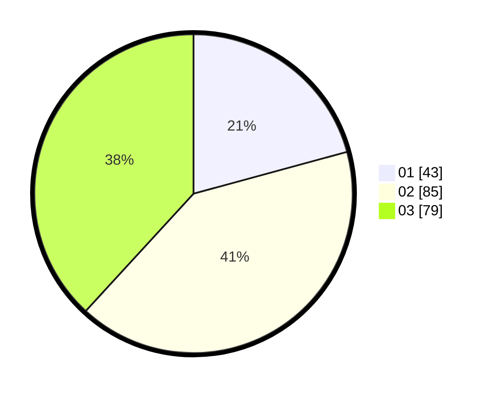

# Hasil

Hasil perolehan suara paslon dapat dilihat pada file paslon-01.txt, paslon-02.txt, dan paslon-03.txt.

Jika tidak ada, artinya data tersebut belum ada pada SIREKAP.

## Perolehan Suara

 * Paslon 01: **43**.
 * Paslon 02: **85**.
 * Paslon 03: **79**.

## Foto C Plano

https://sirekap-obj-formc.kpu.go.id/b26f/pemilu/ppwp/31/75/02/10/06/3175021006081-20240215-005729--7efd0639-bbe3-4726-9a76-52e991d9a12f.jpg

https://sirekap-obj-formc.kpu.go.id/b26f/pemilu/ppwp/31/75/02/10/06/3175021006081-20240215-005903--46c44f37-414f-4f39-8eff-db1447dc201d.jpg

https://sirekap-obj-formc.kpu.go.id/b26f/pemilu/ppwp/31/75/02/10/06/3175021006081-20240215-010032--302a1bbb-f44f-4a12-8e79-ce642b9eefc3.jpg
