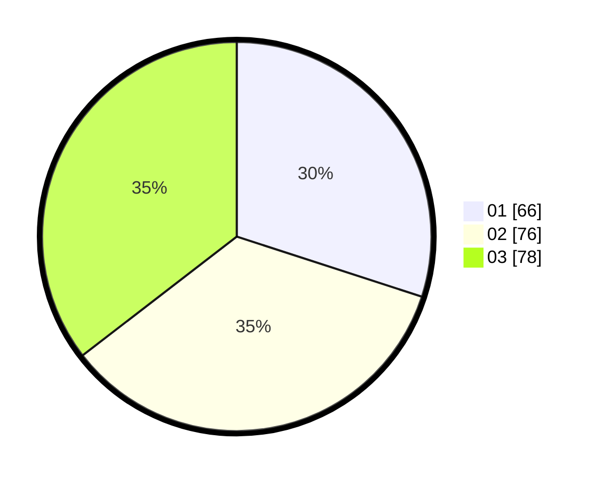

# Hasil

Hasil perolehan suara paslon dapat dilihat pada file paslon-01.txt, paslon-02.txt, dan paslon-03.txt.

Jika tidak ada, artinya data tersebut belum ada pada SIREKAP.

## Perolehan Suara

 * Paslon 01: **66**.
 * Paslon 02: **76**.
 * Paslon 03: **78**.

## Foto C Plano

https://sirekap-obj-formc.kpu.go.id/5ede/pemilu/ppwp/31/75/02/10/06/3175021006083-20240214-185257--3be4f690-92ad-4f53-92c3-786c774ace4e.jpg

https://sirekap-obj-formc.kpu.go.id/5ede/pemilu/ppwp/31/75/02/10/06/3175021006083-20240214-185215--703c5d4a-a024-45cc-adda-612636d58de7.jpg

https://sirekap-obj-formc.kpu.go.id/5ede/pemilu/ppwp/31/75/02/10/06/3175021006083-20240214-190459--ff68ab01-71b2-40f9-b5a1-63f9c7e5b442.jpg

## DATA PEMILIH TETAP

Jumlah pemilih dalam DPT: **285**.
 * L: **148**.
 * P: **137**.

## DATA PENGGUNA HAK PILIH

Jumlah pengguna hak pilih dalam DPT: **217**.
 * L: **110**.
 * P: **107**.

Jumlah pengguna hak pilih dalam DPTb: **6**.
 * L: **4**.
 * P: **2**.

Jumlah pengguna hak pilih dalam DPK: **1**.
 * L: **0**.
 * P: **1**.

Jumlah pengguna hak pilih: **224**.
 * L: **114**.
 * P: **110**.

## JUMLAH SUARA SAH DAN TIDAK SAH

JUMLAH SELURUH SUARA SAH: **220**.

JUMLAH SUARA TIDAK SAH: **4**.

JUMLAH SELURUH SUARA SAH DAN SUARA TIDAK SAH: **224**.
