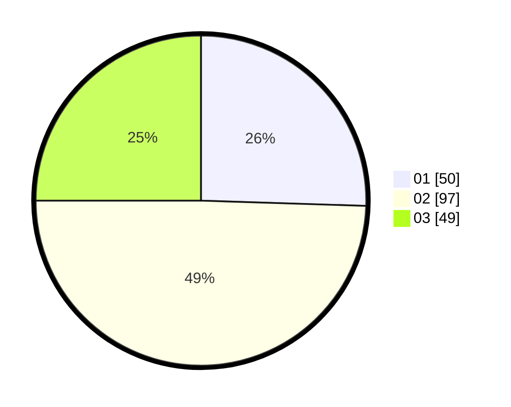

# Hasil

Hasil perolehan suara paslon dapat dilihat pada file paslon-01.txt, paslon-02.txt, dan paslon-03.txt.

Jika tidak ada, artinya data tersebut belum ada pada SIREKAP.

## Perolehan Suara

 * Paslon 01: **50**.
 * Paslon 02: **97**.
 * Paslon 03: **49**.

## Foto C Plano

https://sirekap-obj-formc.kpu.go.id/3beb/pemilu/ppwp/31/75/02/10/06/3175021006086-20240214-225805--da5ae548-6b31-4af2-b6cb-a028240ec072.jpg

https://sirekap-obj-formc.kpu.go.id/3beb/pemilu/ppwp/31/75/02/10/06/3175021006086-20240214-185146--c6a644b6-de72-4f36-b9c3-f75ad7d54466.jpg

https://sirekap-obj-formc.kpu.go.id/3beb/pemilu/ppwp/31/75/02/10/06/3175021006086-20240214-185235--79997107-d5ee-4081-b4eb-58fdbaf647b1.jpg
