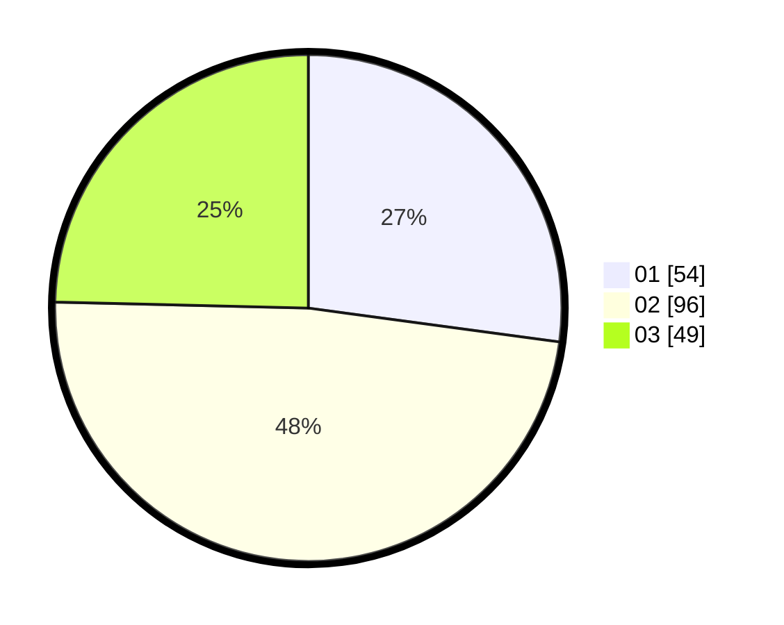

# Hasil

Hasil perolehan suara paslon dapat dilihat pada file paslon-01.txt, paslon-02.txt, dan paslon-03.txt.

Jika tidak ada, artinya data tersebut belum ada pada SIREKAP.

## Perolehan Suara

 * Paslon 01: **54**.
 * Paslon 02: **96**.
 * Paslon 03: **49**.

## Foto C Plano

https://sirekap-obj-formc.kpu.go.id/cb5c/pemilu/ppwp/31/75/02/10/06/3175021006090-20240215-233610--2bec28ec-f0f5-4c68-8166-ed77fb783eee.jpg

https://sirekap-obj-formc.kpu.go.id/cb5c/pemilu/ppwp/31/75/02/10/06/3175021006090-20240214-184523--cb4a4342-16bc-4b7f-9193-ae1df053d148.jpg

https://sirekap-obj-formc.kpu.go.id/cb5c/pemilu/ppwp/31/75/02/10/06/3175021006090-20240214-184655--fc5b1741-1f81-4748-b315-b79ea0a44062.jpg

## DATA PEMILIH TETAP

Jumlah pemilih dalam DPT: **275**.
 * L: **133**.
 * P: **142**.

## DATA PENGGUNA HAK PILIH

Jumlah pengguna hak pilih dalam DPT: **188**.
 * L: **90**.
 * P: **98**.

Jumlah pengguna hak pilih dalam DPTb: **10**.
 * L: **3**.
 * P: **7**.

Jumlah pengguna hak pilih dalam DPK: **3**.
 * L: **0**.
 * P: **3**.

Jumlah pengguna hak pilih: **201**.
 * L: **93**.
 * P: **108**.

## JUMLAH SUARA SAH DAN TIDAK SAH

JUMLAH SELURUH SUARA SAH: **199**.

JUMLAH SUARA TIDAK SAH: **2**.

JUMLAH SELURUH SUARA SAH DAN SUARA TIDAK SAH: **201**.
