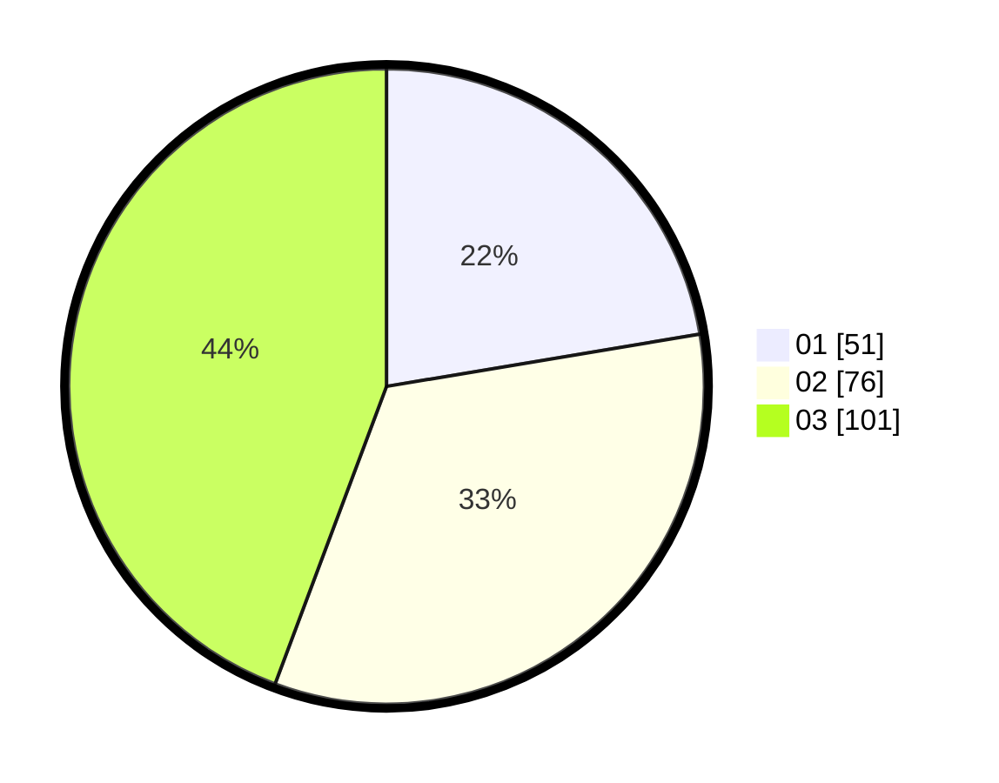

# Hasil

Hasil perolehan suara paslon dapat dilihat pada file paslon-01.txt, paslon-02.txt, dan paslon-03.txt.

Jika tidak ada, artinya data tersebut belum ada pada SIREKAP.

## Perolehan Suara

 * Paslon 01: **51**.
 * Paslon 02: **76**.
 * Paslon 03: **101**.

## Foto C Plano

https://sirekap-obj-formc.kpu.go.id/45ee/pemilu/ppwp/31/75/02/10/06/3175021006096-20240214-155714--27fb4d03-4989-4b18-ad8d-876980c27e5b.jpg

https://sirekap-obj-formc.kpu.go.id/45ee/pemilu/ppwp/31/75/02/10/06/3175021006096-20240214-155900--743ef615-1700-488a-84c2-f9d48e8addee.jpg

https://sirekap-obj-formc.kpu.go.id/45ee/pemilu/ppwp/31/75/02/10/06/3175021006096-20240214-160057--8ae6fdac-fbfe-4347-a83b-148bf101dcc1.jpg

## DATA PEMILIH TETAP

Jumlah pemilih dalam DPT: **233**.
 * L: **119**.
 * P: **114**.

## DATA PENGGUNA HAK PILIH

Jumlah pengguna hak pilih dalam DPT: **221**.
 * L: **110**.
 * P: **111**.

Jumlah pengguna hak pilih dalam DPTb: **12**.
 * L: **9**.
 * P: **3**.

Jumlah pengguna hak pilih dalam DPK: **0**.
 * L: **0**.
 * P: **0**.

Jumlah pengguna hak pilih: **233**.
 * L: **119**.
 * P: **114**.

## JUMLAH SUARA SAH DAN TIDAK SAH

JUMLAH SELURUH SUARA SAH: **228**.

JUMLAH SUARA TIDAK SAH: **5**.

JUMLAH SELURUH SUARA SAH DAN SUARA TIDAK SAH: **233**.
