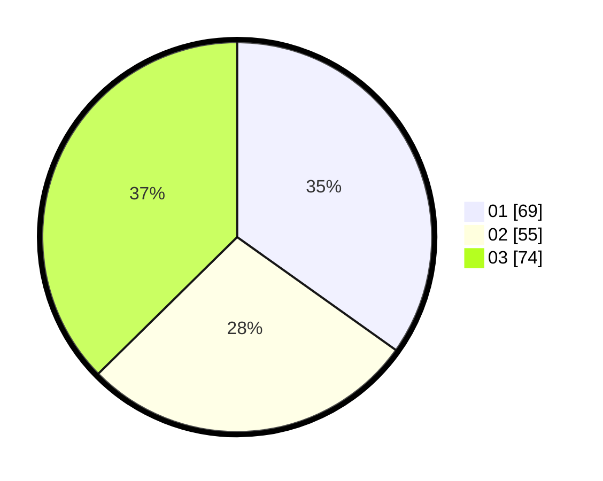

# Hasil

Hasil perolehan suara paslon dapat dilihat pada file paslon-01.txt, paslon-02.txt, dan paslon-03.txt.

Jika tidak ada, artinya data tersebut belum ada pada SIREKAP.

## Perolehan Suara

 * Paslon 01: **69**.
 * Paslon 02: **55**.
 * Paslon 03: **74**.

## Foto C Plano

https://sirekap-obj-formc.kpu.go.id/e26e/pemilu/ppwp/31/75/02/10/06/3175021006098-20240214-194011--1a5bc2cf-14de-4921-9c60-d9a052a3cd7c.jpg

https://sirekap-obj-formc.kpu.go.id/e26e/pemilu/ppwp/31/75/02/10/06/3175021006098-20240214-194454--05cc6dc9-b8db-4078-8d70-c8674da719d6.jpg

https://sirekap-obj-formc.kpu.go.id/e26e/pemilu/ppwp/31/75/02/10/06/3175021006098-20240216-030353--6f80fe27-a418-41ba-a128-dd99d092684e.jpg

## DATA PEMILIH TETAP

Jumlah pemilih dalam DPT: **286**.
 * L: **132**.
 * P: **154**.

## DATA PENGGUNA HAK PILIH

Jumlah pengguna hak pilih dalam DPT: **193**.
 * L: **91**.
 * P: **102**.

Jumlah pengguna hak pilih dalam DPTb: **7**.
 * L: **4**.
 * P: **3**.

Jumlah pengguna hak pilih dalam DPK: **4**.
 * L: **3**.
 * P: **1**.

Jumlah pengguna hak pilih: **204**.
 * L: **98**.
 * P: **106**.

## JUMLAH SUARA SAH DAN TIDAK SAH

JUMLAH SELURUH SUARA SAH: **198**.

JUMLAH SUARA TIDAK SAH: **6**.

JUMLAH SELURUH SUARA SAH DAN SUARA TIDAK SAH: **204**.
