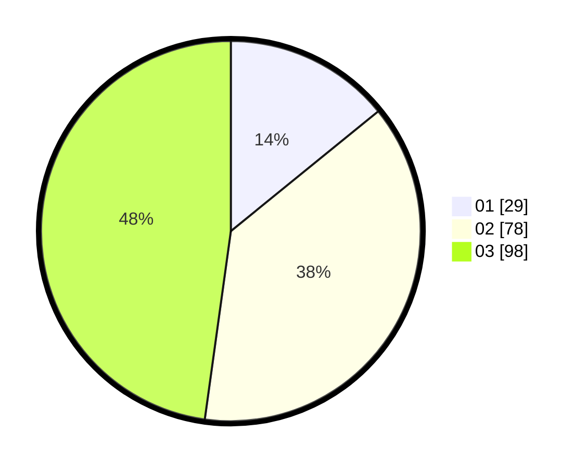

# Hasil

Hasil perolehan suara paslon dapat dilihat pada file paslon-01.txt, paslon-02.txt, dan paslon-03.txt.

Jika tidak ada, artinya data tersebut belum ada pada SIREKAP.

## Perolehan Suara

 * Paslon 01: **29**.
 * Paslon 02: **78**.
 * Paslon 03: **98**.

## Foto C Plano

https://sirekap-obj-formc.kpu.go.id/20b6/pemilu/ppwp/31/75/02/10/06/3175021006100-20240214-184922--a74cea33-174d-4043-9403-30b1c50ff04b.jpg

https://sirekap-obj-formc.kpu.go.id/20b6/pemilu/ppwp/31/75/02/10/06/3175021006100-20240214-184926--f2c93615-5e9c-47d5-b3e7-698c920e9cab.jpg

https://sirekap-obj-formc.kpu.go.id/20b6/pemilu/ppwp/31/75/02/10/06/3175021006100-20240214-184931--fcda49b2-b038-4ceb-9f41-3d7373966d98.jpg

## DATA PEMILIH TETAP

Jumlah pemilih dalam DPT: **276**.
 * L: **131**.
 * P: **145**.

## DATA PENGGUNA HAK PILIH

Jumlah pengguna hak pilih dalam DPT: **191**.
 * L: **92**.
 * P: **99**.

Jumlah pengguna hak pilih dalam DPTb: **15**.
 * L: **5**.
 * P: **10**.

Jumlah pengguna hak pilih dalam DPK: **4**.
 * L: **2**.
 * P: **2**.

Jumlah pengguna hak pilih: **210**.
 * L: **99**.
 * P: **111**.

## JUMLAH SUARA SAH DAN TIDAK SAH

JUMLAH SELURUH SUARA SAH: **205**.

JUMLAH SUARA TIDAK SAH: **5**.

JUMLAH SELURUH SUARA SAH DAN SUARA TIDAK SAH: **210**.
