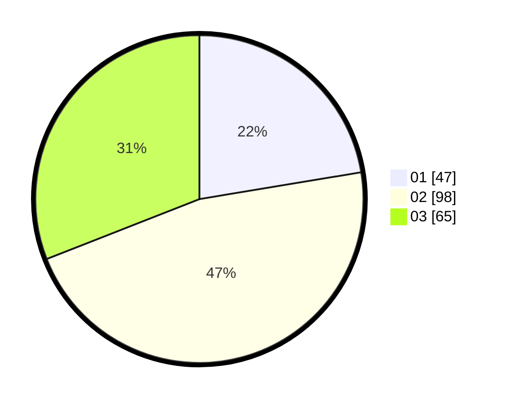

# Hasil

Hasil perolehan suara paslon dapat dilihat pada file paslon-01.txt, paslon-02.txt, dan paslon-03.txt.

Jika tidak ada, artinya data tersebut belum ada pada SIREKAP.

## Perolehan Suara

 * Paslon 01: **47**.
 * Paslon 02: **98**.
 * Paslon 03: **65**.

## Foto C Plano

https://sirekap-obj-formc.kpu.go.id/ee63/pemilu/ppwp/31/75/02/10/06/3175021006103-20240214-194633--239bd240-c7cb-413a-97ae-320c02564078.jpg

https://sirekap-obj-formc.kpu.go.id/ee63/pemilu/ppwp/31/75/02/10/06/3175021006103-20240214-195709--f8101060-0c83-4ef6-a585-0af751dee273.jpg

https://sirekap-obj-formc.kpu.go.id/ee63/pemilu/ppwp/31/75/02/10/06/3175021006103-20240214-195713--55630fc2-0a51-4630-9115-005e368e2414.jpg

## DATA PEMILIH TETAP

Jumlah pemilih dalam DPT: **277**.
 * L: **122**.
 * P: **155**.

## DATA PENGGUNA HAK PILIH

Jumlah pengguna hak pilih dalam DPT: **210**.
 * L: **96**.
 * P: **114**.

Jumlah pengguna hak pilih dalam DPTb: **6**.
 * L: **2**.
 * P: **4**.

Jumlah pengguna hak pilih dalam DPK: **0**.
 * L: **0**.
 * P: **0**.

Jumlah pengguna hak pilih: **216**.
 * L: **98**.
 * P: **118**.

## JUMLAH SUARA SAH DAN TIDAK SAH

JUMLAH SELURUH SUARA SAH: **210**.

JUMLAH SUARA TIDAK SAH: **6**.

JUMLAH SELURUH SUARA SAH DAN SUARA TIDAK SAH: **216**.
