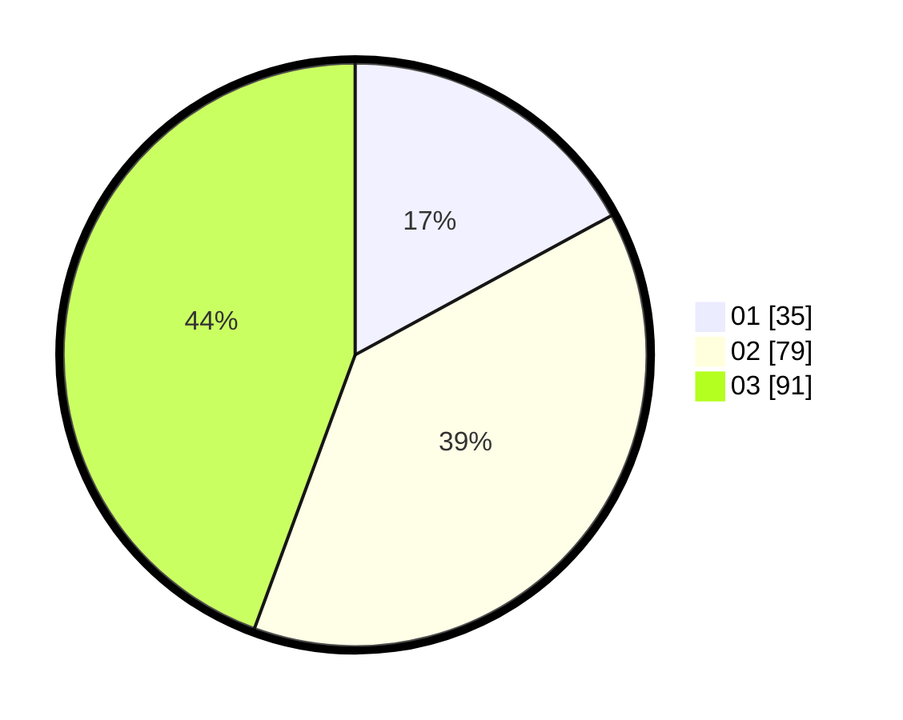

# Hasil

Hasil perolehan suara paslon dapat dilihat pada file paslon-01.txt, paslon-02.txt, dan paslon-03.txt.

Jika tidak ada, artinya data tersebut belum ada pada SIREKAP.

## Perolehan Suara

 * Paslon 01: **35**.
 * Paslon 02: **79**.
 * Paslon 03: **91**.

## Foto C Plano

https://sirekap-obj-formc.kpu.go.id/c584/pemilu/ppwp/31/75/02/10/06/3175021006105-20240215-011715--0d63baeb-f429-40a3-ac27-7bea72b391d8.jpg

https://sirekap-obj-formc.kpu.go.id/c584/pemilu/ppwp/31/75/02/10/06/3175021006105-20240215-011803--83140ce1-1ecc-424b-9c71-94bf5a23f9d2.jpg
