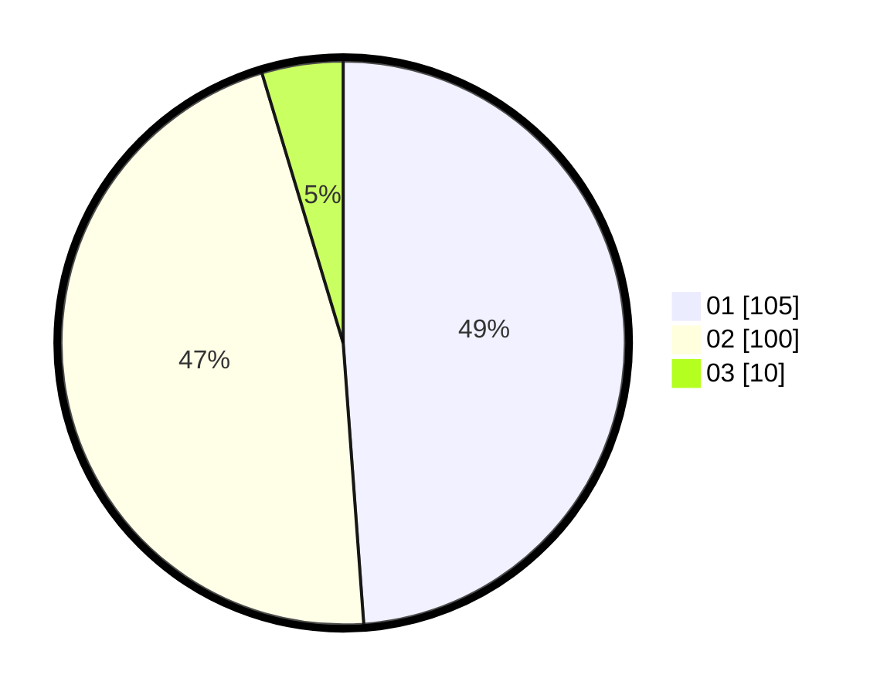

# Hasil

Hasil perolehan suara paslon dapat dilihat pada file paslon-01.txt, paslon-02.txt, dan paslon-03.txt.

Jika tidak ada, artinya data tersebut belum ada pada SIREKAP.

## Perolehan Suara

 * Paslon 01: **105**.
 * Paslon 02: **100**.
 * Paslon 03: **10**.

## Foto C Plano

https://sirekap-obj-formc.kpu.go.id/5d20/pemilu/ppwp/31/75/02/10/06/3175021006108-20240214-192638--8e4af51e-314a-48af-92dd-c8bc788e4b6a.jpg

https://sirekap-obj-formc.kpu.go.id/5d20/pemilu/ppwp/31/75/02/10/06/3175021006108-20240214-192641--e577e082-5118-4447-9446-11b6014b234a.jpg

https://sirekap-obj-formc.kpu.go.id/5d20/pemilu/ppwp/31/75/02/10/06/3175021006108-20240214-192647--827de95b-84b8-43a9-8488-6ceadc390b82.jpg

## DATA PEMILIH TETAP

Jumlah pemilih dalam DPT: **280**.
 * L: **144**.
 * P: **136**.

## DATA PENGGUNA HAK PILIH

Jumlah pengguna hak pilih dalam DPT: **215**.
 * L: **101**.
 * P: **114**.

Jumlah pengguna hak pilih dalam DPTb: **2**.
 * L: **1**.
 * P: **1**.

Jumlah pengguna hak pilih dalam DPK: **2**.
 * L: **2**.
 * P: **0**.

Jumlah pengguna hak pilih: **219**.
 * L: **104**.
 * P: **115**.

## JUMLAH SUARA SAH DAN TIDAK SAH

JUMLAH SELURUH SUARA SAH: **215**.

JUMLAH SUARA TIDAK SAH: **4**.

JUMLAH SELURUH SUARA SAH DAN SUARA TIDAK SAH: **219**.
