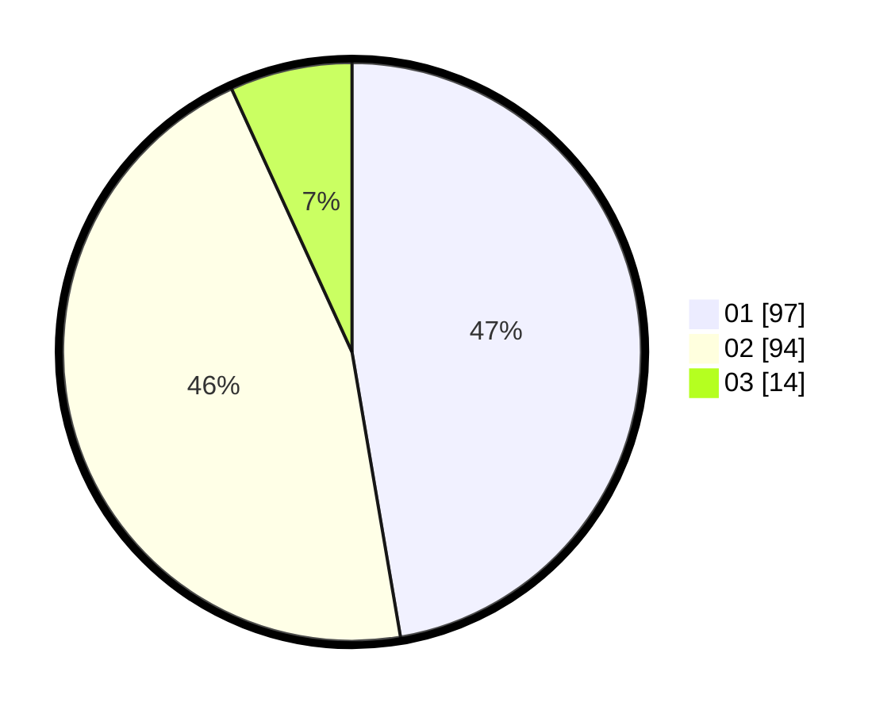

# Hasil

Hasil perolehan suara paslon dapat dilihat pada file paslon-01.txt, paslon-02.txt, dan paslon-03.txt.

Jika tidak ada, artinya data tersebut belum ada pada SIREKAP.

## Perolehan Suara

 * Paslon 01: **97**.
 * Paslon 02: **94**.
 * Paslon 03: **14**.

## Foto C Plano

https://sirekap-obj-formc.kpu.go.id/9b80/pemilu/ppwp/31/75/02/10/06/3175021006111-20240214-211751--c6ea1076-6708-4925-b7e4-68ed125bb16e.jpg

https://sirekap-obj-formc.kpu.go.id/9b80/pemilu/ppwp/31/75/02/10/06/3175021006111-20240214-210548--66e625d4-cb32-496a-bcaa-242bf4a4c252.jpg

https://sirekap-obj-formc.kpu.go.id/9b80/pemilu/ppwp/31/75/02/10/06/3175021006111-20240214-190312--c12381fa-eb02-4324-b29b-7dd8a60da87e.jpg

## DATA PEMILIH TETAP

Jumlah pemilih dalam DPT: **272**.
 * L: **149**.
 * P: **123**.

## DATA PENGGUNA HAK PILIH

Jumlah pengguna hak pilih dalam DPT: **206**.
 * L: **108**.
 * P: **96**.

Jumlah pengguna hak pilih dalam DPTb: **0**.
 * L: **0**.
 * P: **0**.

Jumlah pengguna hak pilih dalam DPK: **0**.
 * L: **0**.
 * P: **0**.

Jumlah pengguna hak pilih: **206**.
 * L: **108**.
 * P: **96**.

## JUMLAH SUARA SAH DAN TIDAK SAH

JUMLAH SELURUH SUARA SAH: **205**.

JUMLAH SUARA TIDAK SAH: **1**.

JUMLAH SELURUH SUARA SAH DAN SUARA TIDAK SAH: **206**.
