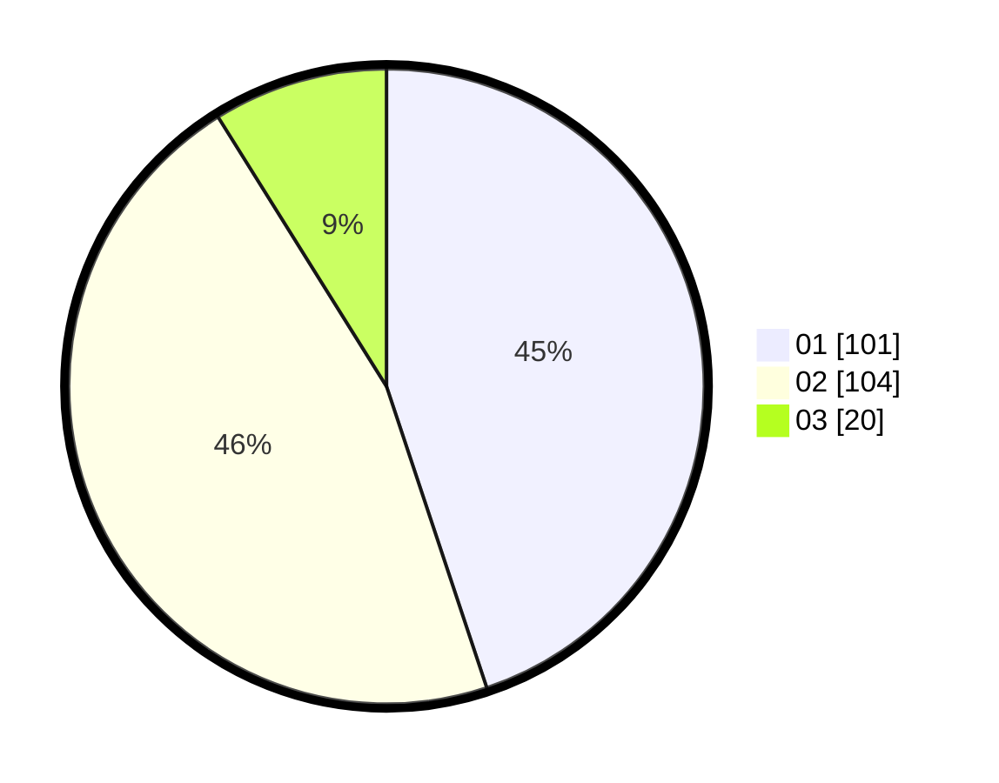

# Hasil

Hasil perolehan suara paslon dapat dilihat pada file paslon-01.txt, paslon-02.txt, dan paslon-03.txt.

Jika tidak ada, artinya data tersebut belum ada pada SIREKAP.

## Perolehan Suara

 * Paslon 01: **101**.
 * Paslon 02: **104**.
 * Paslon 03: **20**.

## Foto C Plano

https://sirekap-obj-formc.kpu.go.id/42e5/pemilu/ppwp/31/75/02/10/06/3175021006113-20240214-155739--8ec6fdb4-9c38-44c7-ba3d-9372f03c6d23.jpg

https://sirekap-obj-formc.kpu.go.id/42e5/pemilu/ppwp/31/75/02/10/06/3175021006113-20240214-210352--fcf7be2f-78bc-441b-8915-d4bb3a85eefc.jpg

https://sirekap-obj-formc.kpu.go.id/42e5/pemilu/ppwp/31/75/02/10/06/3175021006113-20240214-195714--1c8bbd6b-0691-409e-a38f-ce78efd9d5ba.jpg

## DATA PEMILIH TETAP

Jumlah pemilih dalam DPT: **272**.
 * L: **141**.
 * P: **131**.

## DATA PENGGUNA HAK PILIH

Jumlah pengguna hak pilih dalam DPT: **219**.
 * L: **115**.
 * P: **104**.

Jumlah pengguna hak pilih dalam DPTb: **7**.
 * L: **3**.
 * P: **4**.

Jumlah pengguna hak pilih dalam DPK: **3**.
 * L: **2**.
 * P: **1**.

Jumlah pengguna hak pilih: **229**.
 * L: **120**.
 * P: **109**.

## JUMLAH SUARA SAH DAN TIDAK SAH

JUMLAH SELURUH SUARA SAH: **225**.

JUMLAH SUARA TIDAK SAH: **4**.

JUMLAH SELURUH SUARA SAH DAN SUARA TIDAK SAH: **229**.
