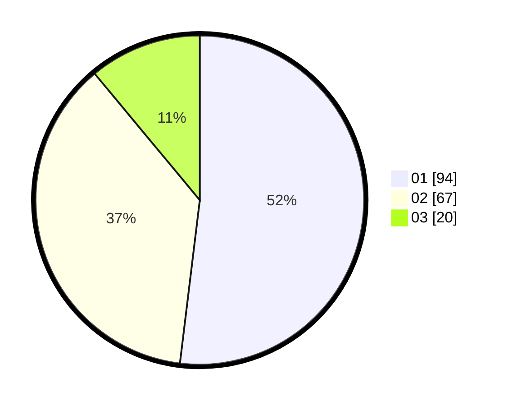

# Hasil

Hasil perolehan suara paslon dapat dilihat pada file paslon-01.txt, paslon-02.txt, dan paslon-03.txt.

Jika tidak ada, artinya data tersebut belum ada pada SIREKAP.

## Perolehan Suara

 * Paslon 01: **94**.
 * Paslon 02: **67**.
 * Paslon 03: **20**.

## Foto C Plano

https://sirekap-obj-formc.kpu.go.id/707a/pemilu/ppwp/31/75/02/10/06/3175021006122-20240214-202357--2fe2b71f-f00d-4607-ad62-ac87082741a9.jpg

https://sirekap-obj-formc.kpu.go.id/707a/pemilu/ppwp/31/75/02/10/06/3175021006122-20240214-160141--8f472a26-7833-4318-bcac-10f18e7f1220.jpg

https://sirekap-obj-formc.kpu.go.id/707a/pemilu/ppwp/31/75/02/10/06/3175021006122-20240214-202401--df9ad6c7-fe53-4acb-b1e6-262189882983.jpg

## DATA PEMILIH TETAP

Jumlah pemilih dalam DPT: **261**.
 * L: **138**.
 * P: **123**.

## DATA PENGGUNA HAK PILIH

Jumlah pengguna hak pilih dalam DPT: **183**.
 * L: **86**.
 * P: **97**.

Jumlah pengguna hak pilih dalam DPTb: **0**.
 * L: **0**.
 * P: **0**.

Jumlah pengguna hak pilih dalam DPK: **0**.
 * L: **0**.
 * P: **0**.

Jumlah pengguna hak pilih: **183**.
 * L: **86**.
 * P: **97**.

## JUMLAH SUARA SAH DAN TIDAK SAH

JUMLAH SELURUH SUARA SAH: **181**.

JUMLAH SUARA TIDAK SAH: **2**.

JUMLAH SELURUH SUARA SAH DAN SUARA TIDAK SAH: **183**.
