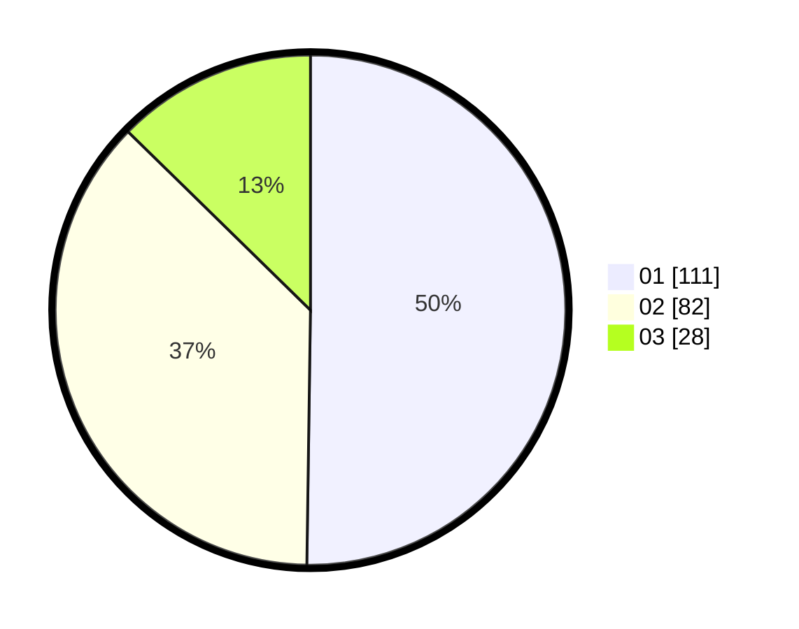

# Hasil

Hasil perolehan suara paslon dapat dilihat pada file paslon-01.txt, paslon-02.txt, dan paslon-03.txt.

Jika tidak ada, artinya data tersebut belum ada pada SIREKAP.

## Perolehan Suara

 * Paslon 01: **111**.
 * Paslon 02: **82**.
 * Paslon 03: **28**.

## Foto C Plano

https://sirekap-obj-formc.kpu.go.id/6431/pemilu/ppwp/31/75/02/10/06/3175021006123-20240214-184550--2f462aad-db4b-4d57-86dc-9c6b956ce892.jpg

https://sirekap-obj-formc.kpu.go.id/6431/pemilu/ppwp/31/75/02/10/06/3175021006123-20240214-155815--60db362d-b49b-4c6c-a5b6-3de22ddee7a8.jpg

https://sirekap-obj-formc.kpu.go.id/6431/pemilu/ppwp/31/75/02/10/06/3175021006123-20240214-155311--57fc4792-9097-4d95-b409-96393de1c36c.jpg

## DATA PEMILIH TETAP

Jumlah pemilih dalam DPT: **267**.
 * L: **131**.
 * P: **136**.

## DATA PENGGUNA HAK PILIH

Jumlah pengguna hak pilih dalam DPT: **213**.
 * L: **108**.
 * P: **105**.

Jumlah pengguna hak pilih dalam DPTb: **1**.
 * L: **1**.
 * P: **0**.

Jumlah pengguna hak pilih dalam DPK: **7**.
 * L: **2**.
 * P: **5**.

Jumlah pengguna hak pilih: **221**.
 * L: **111**.
 * P: **110**.

## JUMLAH SUARA SAH DAN TIDAK SAH

JUMLAH SELURUH SUARA SAH: **221**.

JUMLAH SUARA TIDAK SAH: **0**.

JUMLAH SELURUH SUARA SAH DAN SUARA TIDAK SAH: **221**.
