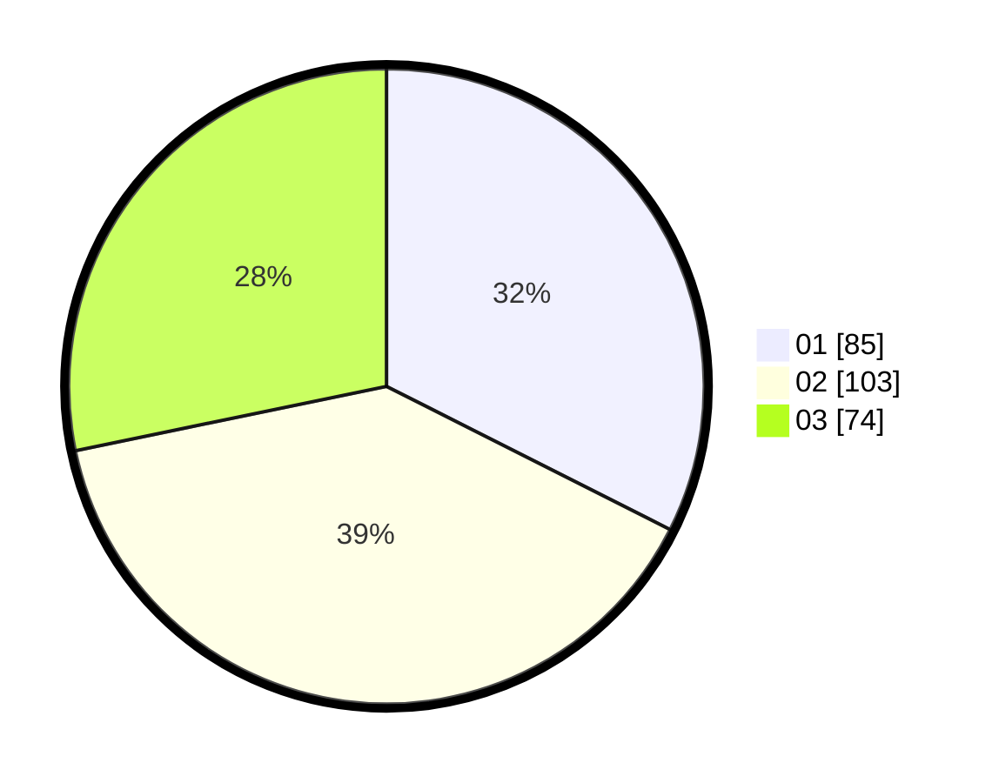

# Hasil

Hasil perolehan suara paslon dapat dilihat pada file paslon-01.txt, paslon-02.txt, dan paslon-03.txt.

Jika tidak ada, artinya data tersebut belum ada pada SIREKAP.

## Perolehan Suara

 * Paslon 01: **85**.
 * Paslon 02: **103**.
 * Paslon 03: **74**.

## Foto C Plano

https://sirekap-obj-formc.kpu.go.id/9592/pemilu/ppwp/31/75/02/10/06/3175021006129-20240214-193338--51e55230-9a74-49f5-a56a-52b6ea440d96.jpg

https://sirekap-obj-formc.kpu.go.id/9592/pemilu/ppwp/31/75/02/10/06/3175021006129-20240214-193037--ced62be6-fd15-453d-8768-c1517cbc4852.jpg

https://sirekap-obj-formc.kpu.go.id/9592/pemilu/ppwp/31/75/02/10/06/3175021006129-20240214-195753--acccb1e3-10fc-4342-a102-885e2333f519.jpg

## DATA PEMILIH TETAP

Jumlah pemilih dalam DPT: **287**.
 * L: **137**.
 * P: **150**.

## DATA PENGGUNA HAK PILIH

Jumlah pengguna hak pilih dalam DPT: **229**.
 * L: **106**.
 * P: **123**.

Jumlah pengguna hak pilih dalam DPTb: **18**.
 * L: **8**.
 * P: **10**.

Jumlah pengguna hak pilih dalam DPK: **17**.
 * L: **8**.
 * P: **9**.

Jumlah pengguna hak pilih: **264**.
 * L: **122**.
 * P: **142**.

## JUMLAH SUARA SAH DAN TIDAK SAH

JUMLAH SELURUH SUARA SAH: **262**.

JUMLAH SUARA TIDAK SAH: **2**.

JUMLAH SELURUH SUARA SAH DAN SUARA TIDAK SAH: **264**.
