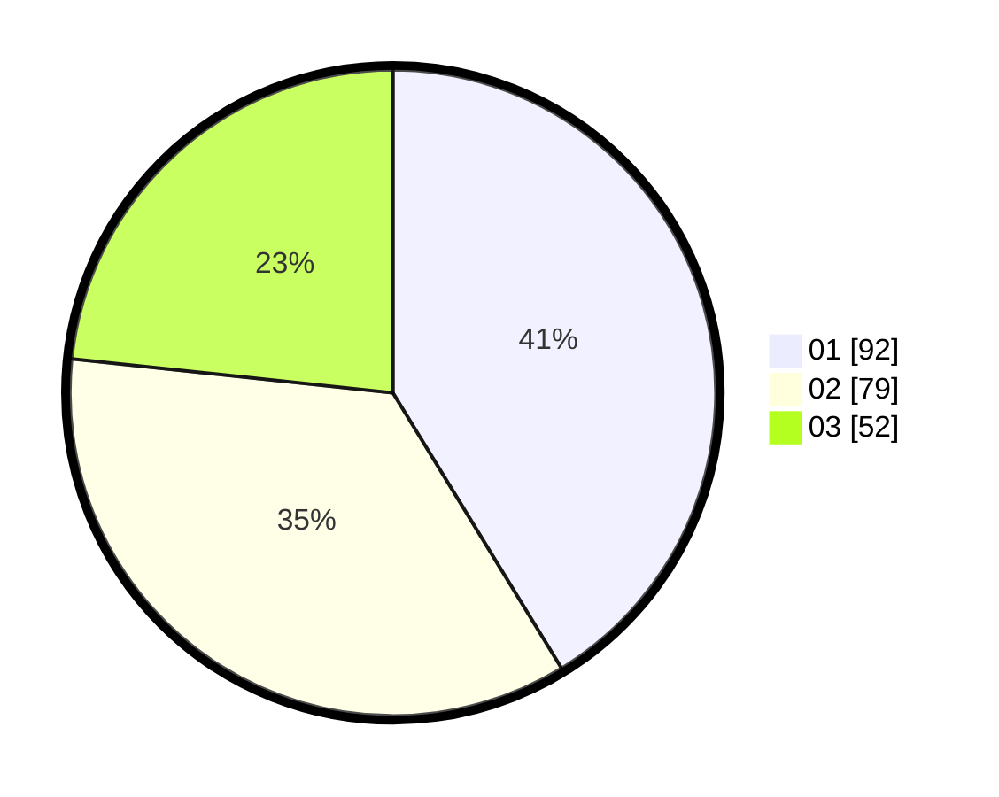

# Hasil

Hasil perolehan suara paslon dapat dilihat pada file paslon-01.txt, paslon-02.txt, dan paslon-03.txt.

Jika tidak ada, artinya data tersebut belum ada pada SIREKAP.

## Perolehan Suara

 * Paslon 01: **92**.
 * Paslon 02: **79**.
 * Paslon 03: **52**.

## Foto C Plano

https://sirekap-obj-formc.kpu.go.id/08d7/pemilu/ppwp/31/75/02/10/06/3175021006132-20240215-210245--b1035026-ce98-4942-950f-2a916dbc4200.jpg

https://sirekap-obj-formc.kpu.go.id/08d7/pemilu/ppwp/31/75/02/10/06/3175021006132-20240214-185236--85ce0905-0701-43dc-b022-aaf834eb8194.jpg

https://sirekap-obj-formc.kpu.go.id/08d7/pemilu/ppwp/31/75/02/10/06/3175021006132-20240214-184829--78665df1-37d9-464b-834b-a85654b323d5.jpg

## DATA PEMILIH TETAP

Jumlah pemilih dalam DPT: **269**.
 * L: **137**.
 * P: **132**.

## DATA PENGGUNA HAK PILIH

Jumlah pengguna hak pilih dalam DPT: **214**.
 * L: **110**.
 * P: **104**.

Jumlah pengguna hak pilih dalam DPTb: **7**.
 * L: **2**.
 * P: **5**.

Jumlah pengguna hak pilih dalam DPK: **3**.
 * L: **1**.
 * P: **2**.

Jumlah pengguna hak pilih: **224**.
 * L: **113**.
 * P: **111**.

## JUMLAH SUARA SAH DAN TIDAK SAH

JUMLAH SELURUH SUARA SAH: **223**.

JUMLAH SUARA TIDAK SAH: **1**.

JUMLAH SELURUH SUARA SAH DAN SUARA TIDAK SAH: **224**.
