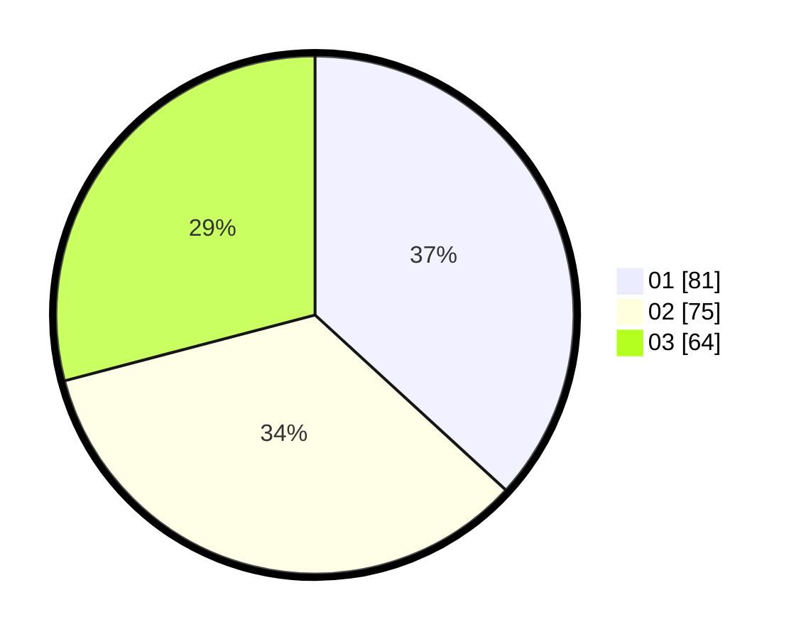

# Hasil

Hasil perolehan suara paslon dapat dilihat pada file paslon-01.txt, paslon-02.txt, dan paslon-03.txt.

Jika tidak ada, artinya data tersebut belum ada pada SIREKAP.

## Perolehan Suara

 * Paslon 01: **81**.
 * Paslon 02: **75**.
 * Paslon 03: **64**.

## Foto C Plano

https://sirekap-obj-formc.kpu.go.id/2f6f/pemilu/ppwp/31/75/02/10/07/3175021007016-20240214-201759--7759827e-f056-42ac-ab18-0dd38f8bfeca.jpg

https://sirekap-obj-formc.kpu.go.id/2f6f/pemilu/ppwp/31/75/02/10/07/3175021007016-20240214-201849--7b312d57-5675-44df-bb4a-b3d4027e4cc2.jpg

https://sirekap-obj-formc.kpu.go.id/2f6f/pemilu/ppwp/31/75/02/10/07/3175021007016-20240214-201933--a935b0f2-dbfa-4d03-8254-6ba883319b84.jpg
