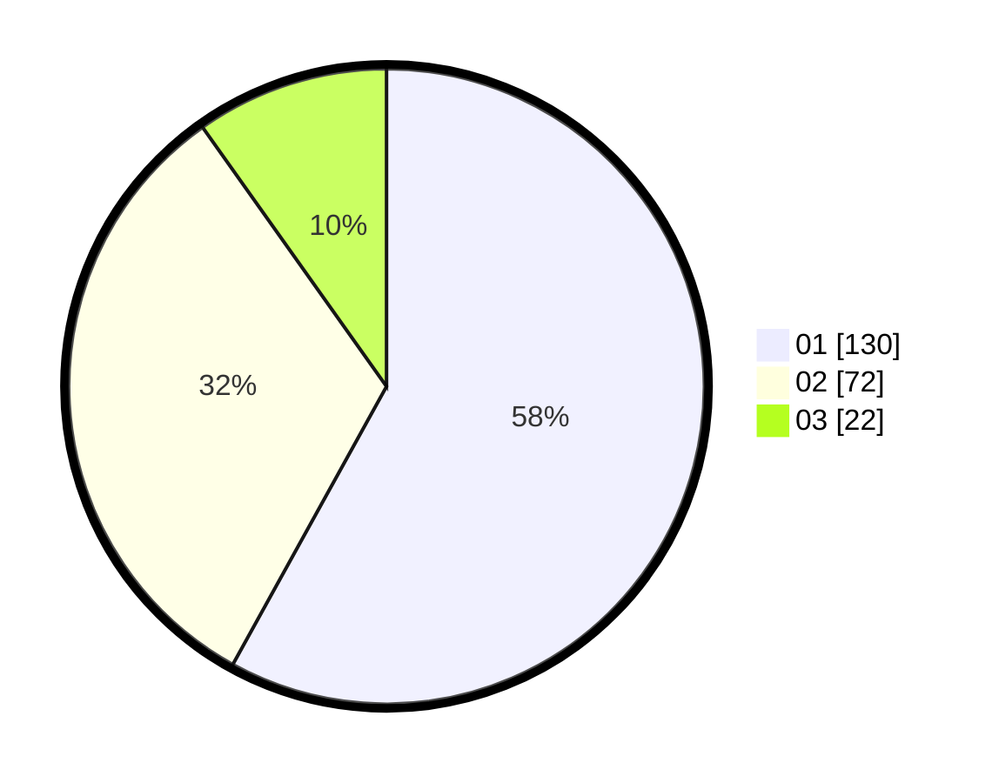

# Hasil

Hasil perolehan suara paslon dapat dilihat pada file paslon-01.txt, paslon-02.txt, dan paslon-03.txt.

Jika tidak ada, artinya data tersebut belum ada pada SIREKAP.

## Perolehan Suara

 * Paslon 01: **130**.
 * Paslon 02: **72**.
 * Paslon 03: **22**.

## Foto C Plano

https://sirekap-obj-formc.kpu.go.id/fd89/pemilu/ppwp/31/75/02/10/07/3175021007019-20240214-200700--f61c2eaa-b286-48b4-a9ac-a69addc7c49d.jpg

https://sirekap-obj-formc.kpu.go.id/fd89/pemilu/ppwp/31/75/02/10/07/3175021007019-20240214-201001--eba31c2b-8395-47e7-b83a-7f5c81cf76dd.jpg

https://sirekap-obj-formc.kpu.go.id/fd89/pemilu/ppwp/31/75/02/10/07/3175021007019-20240214-201054--427e82fc-a47c-42ed-8c07-51de7f838e63.jpg

## DATA PEMILIH TETAP

Jumlah pemilih dalam DPT: **266**.
 * L: **124**.
 * P: **142**.

## DATA PENGGUNA HAK PILIH

Jumlah pengguna hak pilih dalam DPT: **211**.
 * L: **99**.
 * P: **112**.

Jumlah pengguna hak pilih dalam DPTb: **5**.
 * L: **0**.
 * P: **5**.

Jumlah pengguna hak pilih dalam DPK: **9**.
 * L: **4**.
 * P: **5**.

Jumlah pengguna hak pilih: **225**.
 * L: **103**.
 * P: **122**.

## JUMLAH SUARA SAH DAN TIDAK SAH

JUMLAH SELURUH SUARA SAH: **224**.

JUMLAH SUARA TIDAK SAH: **1**.

JUMLAH SELURUH SUARA SAH DAN SUARA TIDAK SAH: **225**.
