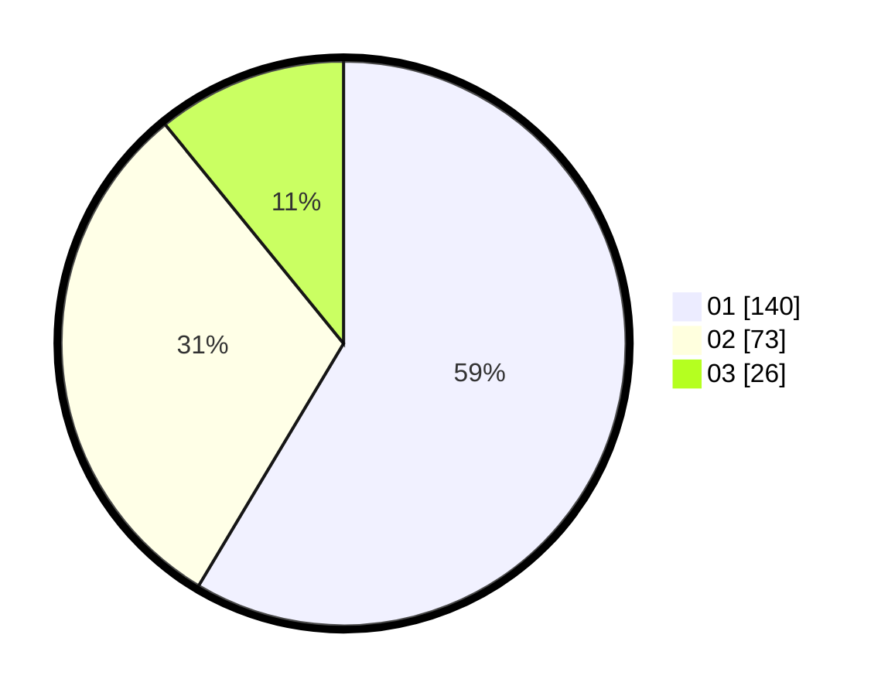

# Hasil

Hasil perolehan suara paslon dapat dilihat pada file paslon-01.txt, paslon-02.txt, dan paslon-03.txt.

Jika tidak ada, artinya data tersebut belum ada pada SIREKAP.

## Perolehan Suara

 * Paslon 01: **140**.
 * Paslon 02: **73**.
 * Paslon 03: **26**.

## Foto C Plano

https://sirekap-obj-formc.kpu.go.id/40a1/pemilu/ppwp/31/75/02/10/07/3175021007031-20240214-184504--6d309fc1-af94-4795-b3ab-403be264c3c0.jpg

https://sirekap-obj-formc.kpu.go.id/40a1/pemilu/ppwp/31/75/02/10/07/3175021007031-20240214-184723--4de750c2-c2d6-451e-b59f-7da5b28f2df0.jpg

https://sirekap-obj-formc.kpu.go.id/40a1/pemilu/ppwp/31/75/02/10/07/3175021007031-20240214-184817--0b070b48-79da-4343-92e4-63038c37a68b.jpg

## DATA PEMILIH TETAP

Jumlah pemilih dalam DPT: **283**.
 * L: **142**.
 * P: **141**.

## DATA PENGGUNA HAK PILIH

Jumlah pengguna hak pilih dalam DPT: **237**.
 * L: **111**.
 * P: **126**.

Jumlah pengguna hak pilih dalam DPTb: **0**.
 * L: **0**.
 * P: **0**.

Jumlah pengguna hak pilih dalam DPK: **3**.
 * L: **1**.
 * P: **2**.

Jumlah pengguna hak pilih: **240**.
 * L: **112**.
 * P: **128**.

## JUMLAH SUARA SAH DAN TIDAK SAH

JUMLAH SELURUH SUARA SAH: **239**.

JUMLAH SUARA TIDAK SAH: **1**.

JUMLAH SELURUH SUARA SAH DAN SUARA TIDAK SAH: **240**.
